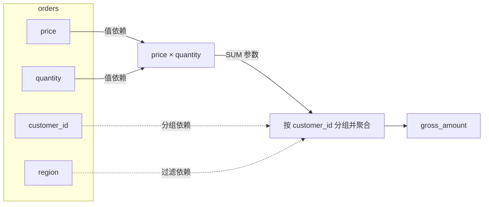
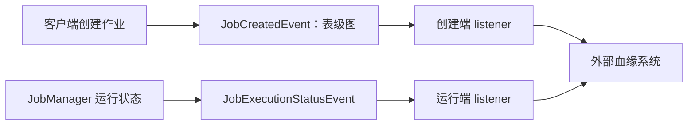
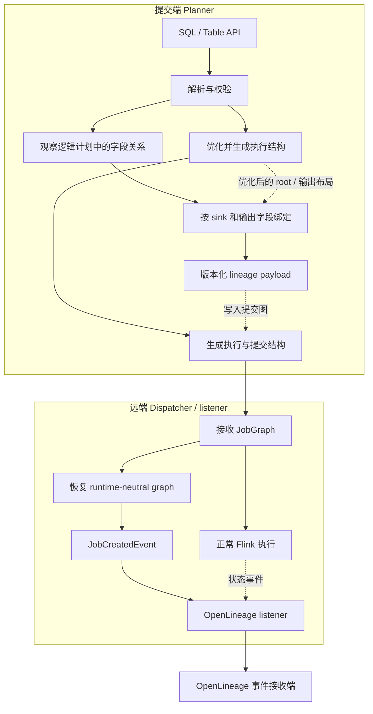
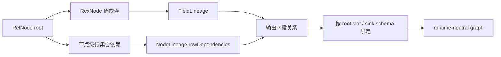
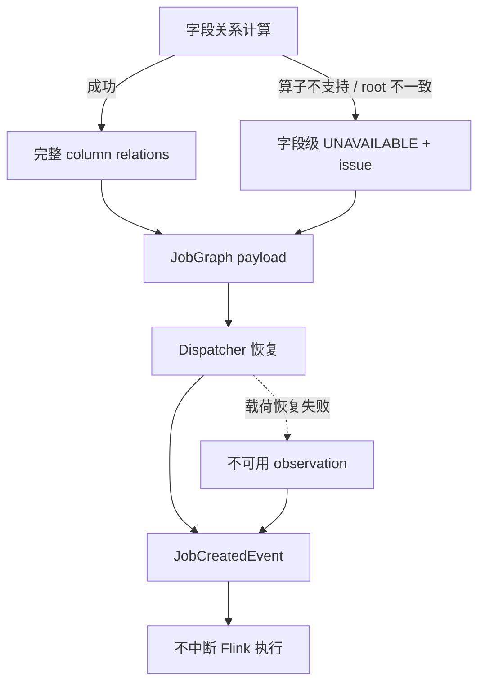

# Flink 字段血缘系列（一）：从表级血缘到字段血缘

我一开始只想把 OpenLineage 的表级事件接通，后来很快发现它回答不了最常见的追问：一个指标字段到底是怎么算出来的？真正影响指标治理的问题通常更细——哪些输入字段参与了计算，过滤条件和分组键是否也算依赖，恢复执行后这些关系还在不在。

这次我在自己的 Flink 2.4 分支上做了一次尝试：在原有表级 Job Lineage 基础上增加 Planner 生成的 column lineage，再把关系交给远端 listener。后面说的“原生”，指的是关系在 Flink 规划与提交链路内生成和交付，不是说官方发行版已经提供了这项能力。

第一篇先从一条聚合 SQL 说起，再回顾社区已有的工作，然后展开我的设计：字段依赖怎样计算，怎样绑定到 sink，又怎样随作业交付。保存计划和提取失败的处理放在最后。具体源码留到第二篇，几条实现路径的比较放到第三篇。

## 一、从一条聚合 SQL 看字段血缘要解决什么

```sql
INSERT INTO customer_summary
SELECT
    customer_id,
    SUM(price * quantity) AS gross_amount,
    COUNT(*) AS order_count
FROM orders
WHERE region = 'CN'
GROUP BY customer_id;
```

表级图只有 `orders → customer_summary`。它无法区分：`price` 和 `quantity` 参与输出值计算，`customer_id` 决定分组，`region` 决定哪些行进入聚合，`COUNT(*)` 依赖输入行集合而不是某一列。



字段血缘至少需要保留输出字段、输入 dataset 和字段、依赖角色以及处理过程。`DIRECT` 表示输入字段参与输出值的求值；`INDIRECT` 表示输入字段通过过滤、连接、分组等条件影响输出行的产生或归属。这里的“直接”不是指只经过一层运算。`COUNT(*)` 没有普通输入字段参数，但仍有输入表的行集合依赖，不能把空字段集合解释为“没有来源”。

这次我先保留字段依赖及处理类别，暂时不还原完整的计算公式。

## 二、社区已经做到哪里

下面的状态是我在 2026 年 9 月 25 日查到的公开信息，范围限于这几个直接相关的提案、任务和 PR。

- **[FLIP-314](https://cwiki.apache.org/confluence/spaces/FLINK/pages/255070913/FLIP-314+Support+Customized+Job+Lineage+Listener)**：自定义 Job Lineage Listener、表级图和作业事件；提案已接受，页面标注 Release 1.19。
- **[FLINK-31275](https://issues.apache.org/jira/browse/FLINK-31275)**：Job Lineage 相关任务集合；父任务仍为 Open，子任务状态不一。
- **[PR #26089](https://github.com/apache/flink/pull/26089)**：暴露 QueryOperation，交给 listener 分析；核查时为 Closed，未合并。
- **[PR #28002](https://github.com/apache/flink/pull/28002)**：Dispatcher 侧 listener 和跨进程交付；核查时为 Open.

### FLIP-314：先有统一的表级事件出口

FLIP-314 定义了 `JobCreatedEvent` 和 `JobExecutionStatusEvent`。前者携带作业创建时的 lineage graph，后者描述运行状态。它为外部系统提供了稳定的事件出口，也把 column lineage 和 JobManager 侧上报列为后续方向。



这条职责划分带来一个实际边界：客户端规划阶段知道的关系，不会因为 JobManager 也注册了 listener 就自动跨网络出现。

FLIP-314 还讨论过一个现实约束：如果把较大的血缘信息直接放进 JobGraph，可能增加提交载荷和运行端处理成本，因此首阶段采用客户端与运行端分别上报的方向，并把 column lineage 和后续合并留给后续设计。我这次采用的 JobGraph 载荷路径正好落在这个已被提出、但仍需定义协议和失败边界的后续问题上。

### 两条相邻但不同的社区路线

PR #26089 代表“暴露查询表示，再由消费者分析”：listener 获取 `QueryOperation`，消费者理解 Flink 计划结构。它让分析入口可见，但也把 Planner 内部类型和版本变化暴露给每个消费者。

这条讨论还明确提到 Calcite `RelNode` 可以用于字段血缘分析，并引用了 `HamaWhiteGG/flink-sql-lineage` 作为已有实现。这说明原项目与 Flink 上游讨论并不是两条互不相干的路线；但该 PR 讨论的是暴露分析入口，不能直接等同于完整的原生 column lineage 传输模型。[PR #26089](https://github.com/apache/flink/pull/26089)

PR #28002 主要讨论 listener 创建位置和 Dispatcher 生命周期。它解决“由哪个进程创建和消费事件”，但不等同于已经定义了完整 column lineage 语义。

我的侧重点仍然是 column lineage：**在 Planner 内把字段关系算出来，把结果而不是 Planner 私有对象交给 listener。** 已有项目和上游讨论给了我不少参考；这份实现目前仍是个人分支上的探索。

## 三、方案设计：从 Planner 计算到远端交付

有了社区提供的事件出口，我接下来要决定的是：字段关系在哪一层生成？这个选择会直接影响数据模型、优化后的绑定方式，以及跨进程传输的内容。

### 提取职责为什么放在 Planner

SQL 文本不足以重建一次提交的语义。Catalog、临时视图、UDF、类型推导和版本都会改变计划；提交之后再解析，必须再次建立完全相同的上下文。

让 listener 获取 `QueryOperation` 有一个明显优点：消费者可以自行选择分析规则。但复杂度并没有消失，消费侧仍要承担查询表示到字段关系的转换；不同集成可以共享分析库，但仍需要维护与 Flink 计划表示之间的兼容关系。

在 Planner 内提取并交付关系，则把复杂度集中在 Flink 核心：

- **listener 自行分析 QueryOperation**：消费者可定制；成本由消费侧承担，包括查询表示到字段关系的转换，以及与 Flink 版本的兼容。
- **Planner 交付解释后的关系**：复用一次名称解析、类型推导和计划语义；成本由 Flink 核心承担，包括提取规则、版本化协议和兼容性。

我选择了第二种。代价也很明确：提取规则和传输协议需要在 Flink 一侧维护。当前还没有测量 Planner 的增量耗时和 lineage payload 大小，功能测试也回答不了这两个性能问题。

### 3.1 先看关系从哪里产生、交给谁



Planner 负责解释 RelNode/RexNode 并形成关系；绑定阶段把逻辑关系定位到优化后的 sink/source；协议层只携带 dataset、字段、关系和状态，不搬运 Planner 或 Catalog 私有对象；OpenLineage 集成负责把关系映射成 `columnLineage` facet。

连接器元数据是另一层问题。通用字段关系可以跨进程恢复，不代表远端拥有完整的 `CatalogBaseTable` 或 connector-specific metadata。集成侧可以构造满足事件需要的兼容元数据，但不能把它描述成原始 Catalog 对象的完整恢复。

### 3.2 我先把“字段来源”拆成三个可计算的问题

设计 column lineage 时，最先遇到的不是传输格式，而是语义边界。如果只把 SQL 中出现过的列名收集出来，下面三种关系会被混在一起：字段参与了输出值计算、字段影响了结果行是否存在、字段只是表达式里的常量或系统值。实现因此把一次关系计算拆成三个阶段。

第一阶段计算值依赖。对 `price * quantity`，`price` 和 `quantity` 都是输出值的输入；对 `CAST(price AS DECIMAL)`，输入仍是 `price`，但增加 `CAST` 处理标签；对 `1`，没有输入字段，来源是 `CONSTANT`。这里的输入字段来自 `RexInputRef`，不是重新扫描 SQL 文本。原项目已经展示了从计划提取字段来源的可行性；我继续要解决的是如何把这份结果纳入 Flink 作业生命周期。

第二阶段计算行集合依赖。`WHERE region = 'CN'` 不改变 `gross_amount` 的算术表达式，却改变哪些订单可以进入聚合；`GROUP BY customer_id` 不一定出现在 `SUM` 的参数中，却改变了输入行归属于哪个输出组。实现把这些依赖保存为节点级集合，最后补到每一个输出字段上，并将输入标成 `INDIRECT`。

第三阶段才把字段关系绑定到 sink。优化器可能复制、重排或复用 relational root；如果输出身份和字段位置在优化后没有重新校验，逻辑关系就可能绑定到错误的 sink，或者在多输出场景中被错误合并。绑定阶段必须同时使用 root slot、sink identity 和输出 schema，把同一份关系定位到实际执行的 sink 字段。



这个拆分解释了几个容易误读的结果：`COUNT(*)` 的 `origin` 是 `SYSTEM`，但它仍然会带有分组或过滤字段的 `INDIRECT` 依赖；`SUM(1)` 不是来自某个输入列，而是系统聚合对输入行集合的结果；同一个字段可能同时以 `DIRECT` 和 `INDIRECT` 出现，因为它既参与值计算，又参与过滤或分组。

### 3.3 用两层状态承接上述计算

前面拆出了值依赖、行集合依赖和输出绑定。它们需要沿 relational plan 逐层传递，最后再绑定到实际 sink。具体的 `FieldLineage`、`NodeLineage` 对象、算子传播规则和测试放在第二篇源码文章中；这里先保留设计上的分工：字段状态描述值来源，节点状态描述行集合影响，绑定状态描述输出归属。

这也是我把语义标签放在 Planner 侧生成的原因：展示层可以画出箭头，却无法单靠箭头补回 `DIRECT`、`INDIRECT` 和 `SYSTEM` 的区别。

### 3.4 从中间状态收敛到输出关系

计算完成后，需要将中间状态整理成面向 sink 的输出契约。前面的 `FieldLineage` 和 `NodeLineage` 服务于递归计算；下面这些信息则服务于绑定、传输和消费：

- **输出 dataset/field**：关系最终落在哪个 sink 字段。
- **输入 dataset/field**：来源的完整身份和字段名。
- **origin**：输出值的来源类别：`INPUT_FIELDS`、`CONSTANT`、`SYSTEM`。
- **dependency type**：某个输入字段的影响方式：`DIRECT` 或 `INDIRECT`。
- **transformation**：表达式、过滤、Join、聚合、分组等标签。
- **status/diagnostic**：关系完整、不可用及原因。

设计有三个约束：

1. 关系必须绑定到正确的输出字段；多个 sink 共享上游时不能把关系混成一份。
2. 直接提交和 Compiled Plan restore 都必须能交付同一份关系事实。
3. 血缘提取失败要报告不可用，不得伪造完整关系，也不得把观测失败升级成 Flink 执行失败。

### 3.5 计算不完整时，怎样表达结果

有了关系模型，还需要回答另一种情况：某个节点无法分析，或者关系无法绑回 sink，此时下游应该收到什么？

字段关系的内容和它是否完整，是两个不同问题。`FieldLineage` 负责描述已经算出的输入和 transformation；提取器遇到不支持的 RelNode、root 对不上或 payload 校验失败时，不能清空这些概念后假装“没有血缘”。实现把可用性和诊断放到 binder、transport 和事件层：



这样做有两个工程结果。第一，OpenLineage 可以区分“没有输入字段的系统聚合”和“字段关系没有生成”；第二，血缘观测失败不会改变 Flink 的执行结果，但事件仍然携带诊断，便于后续补规则。失败隔离不是把问题吞掉，而是把问题放在正确的状态层。

### 3.6 把关系送到远端 listener

前面的步骤确定了关系内容、输出身份和可用状态。接下来要让这些信息跨过提交端与运行端之间的进程边界。

Planner 私有对象不能直接跨 Dispatcher 边界传输。载荷只包含稳定的 dataset registry、输出字段、输入字段、`origin`、`dependencyType`、transformation 和状态诊断。dataset 先注册成整数 id，关系引用 id，减少重复字符串，也让反序列化可以校验“关系引用的字段是否真实存在”。

```text
Planner objects        runtime-neutral payload        listener event
RelNode / Catalog  ->  datasets + relations       ->  columnLineage facet
RexNode / Table API    columnRelations             ->  START / COMPLETE
```

这里刻意没有把完整 `CatalogBaseTable` 当作协议内容。表名、namespace、字段和关系是通用事实；connector options、table kind、comment 等 metadata 是否能够恢复，由 OpenLineage 集成根据事件环境重建。这样可以把 Flink 核心协议和具体 connector 的展示需求分开。

## 四、方案怎样覆盖不同执行路径

前一部分沿普通提交链路解释了各组件的职责。保存计划会改变关系的取得方式，提取失败会改变事件中的可用状态，因此还要单独检查这两个分支。

### 4.1 直接执行与保存计划恢复

直接执行从当前 Planner 得到关系；Compiled Plan restore 需要从保存的计划恢复关系。按这里采用的字段血缘语义，两条路径的关系应一致。验证时要比较最终事件，而不是只比较作业是否成功。

字段提取失败时，执行路径继续按 Flink 原有语义运行，事件标记字段级 `UNAVAILABLE` 并留下诊断。表级关系和字段级关系的状态可以不同，消费者不能把“字段缺失”误读成“没有输入表”。

### 4.2 当前覆盖范围

当前原型围绕投影、表达式、过滤、Join、聚合、窗口、集合操作、多 sink 和 Compiled Plan 展开。复杂 Correlate、UDTF、递归、模式匹配以及连接器隐含的外部访问，需要逐项定义语义；不能由“Planner 内提取”推导出所有 SQL 都已覆盖。

第二篇沿这条链路进入提取器、绑定器和传输层源码，解释每一步如何实现。第三篇把它与独立解析服务、Dinky 放到同一个业务案例中，比较三者的分析上下文、输出关系和适用场景。
