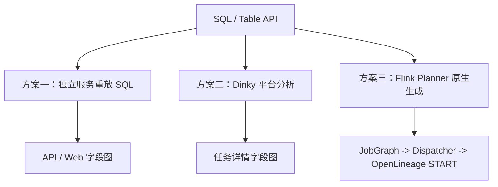
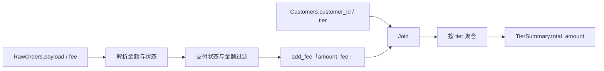
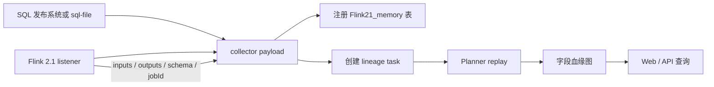
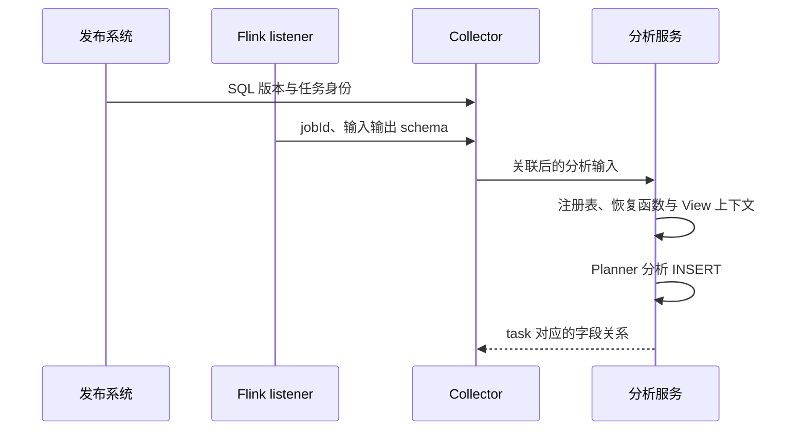
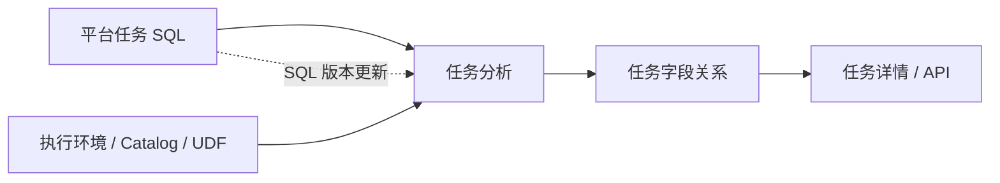

# Flink 字段血缘系列（三）：从开源分析到 Flink 原生解析

前两篇讨论了 Flink 核心改造，但这不是这条路线的起点。最初使用并扩展的是 `flink-sql-lineage`：把 schema、SQL 和 listener 事件接起来，再继续处理 Planner、JobGraph 和 OpenLineage 之间的交付链路。本文将 Dinky 的平台侧分析也放进同一条业务链路中比较。

本文用订单汇总中的 `TierSummary.total_amount` 贯穿比较：先交代原项目和 fork，再分别看独立服务、Dinky 和 Flink 内部方案的设计，最后把已经拿到的结果与尚未完成的核对项分开写。这里不是三套产品的统一 benchmark；三条路径的环境、入口和证据等级并不相同。

## 这三条路径不是从同一个起点开始

原始 `flink-sql-lineage` 是可以独立运行的字段分析系统，利用 Flink/Calcite 计划计算字段来源。`flink2.1` fork 在它的基础上接入作业 listener、输入输出 schema、SQL 关联和服务端 replay。后来在 Flink 2.4 中进行的改造，则把关注点转向关系的保存与交付：让本次 Planner 产生的结果跟随作业提交。

三者的侧重点不同：原项目提供分析基础，fork 负责连接作业事件与分析服务，Flink 核心改造继续处理 Planner 到 Dispatcher 的关系交付。

### 一个值得参考的旁支：ANTLR4 语法树分析

另一个值得放在一起看的项目是 [flinksql-parse](https://github.com/dnegxuantian/flinksql-parse)。它和 fork 不是同一条实现路线：入口是 ANTLR4 生成的 Lexer/Parser，再由 Visitor 遍历语法树；Flink 方案则依赖 Flink/Calcite 完成解析、校验、类型推导和 RelNode 计划生成。

它不必单独作为“第四套产品”，放在“计算依据”这一层更准确：

- **ANTLR4 ParseTree + Visitor**：可以从 SQL 文本识别表、别名、字段引用和部分表达式关系；作用域、字段绑定、Schema、嵌套查询和语义规则需要自己维护。
- **Flink/Calcite RelNode + Planner**：可以使用本次提交已经完成的解析、校验、类型推导和优化计划；仍需要维护 Planner 内的提取规则、关系模型和跨进程交付。

这条路线把字段绑定的难点摆得很清楚。未限定列名不能只按“当前所有表”展开，必须结合 Schema 判断真正的归属；子查询要保存和恢复别名作用域；`SELECT *` 遇到不完整 Schema 时，也不能把未知字段集合当成完整展开。这些都可以反过来变成 Planner 提取器的回归场景。

它的关系模型目前主要是 `targetColumn`、`sources` 和 `transformExpression`，没有直接表达 `DIRECT`、`INDIRECT`、`SYSTEM` 这些角色。因此它适合用来参考 SQL 语法树解析和测试案例，但来源集合不能直接等同于本系列定义的 column lineage 语义。这里的判断来自代码静态阅读，本轮没有运行它的构建和测试。

这条旁支把四个问题区分开来：SQL 能否解析、字段能否绑定、依赖角色是否正确、关系能否随 Flink 作业交付。语法树项目主要回答前两个问题，Planner 方案继续处理后两个问题。

## 一、总览：三种方案分别在哪一层计算血缘



- **`flink-sql-lineage`**：作业事件到达后计算；依据 listener schema、外部保存的 SQL 和 replay Planner；结果交给独立服务 API/Web；代价是重新构造 Catalog、函数和 SQL 上下文。
- **Dinky**：在 Studio 校验或任务分析阶段计算；依据平台保存的作业、执行环境和 Planner；结果进入 Dinky 任务详情/API；代价是依赖平台版本、JAR 和执行环境。
- **Flink + OpenLineage**：在提交作业的 Planner 阶段计算；依据本次提交实际使用的 RelNode/RexNode 和优化后的 sink；结果通过 JobGraph、Dispatcher 进入 OpenLineage 事件；代价是需要 Flink 核心传输和 listener 协议支持。

比较的起点就是这三个计算位置。这里的“原生”描述提取和交付发生的位置；字段依赖本身仍由计划静态推导，并不逐条追踪运行中的数据记录。

## 二、用同一条业务链路确定比较对象

三种方案都使用下面这条业务链路：解析订单 JSON，过滤已支付订单，用 `add_fee` 计算净金额，与客户表 Join，再按客户等级聚合。



目标关系不是“找出 SQL 中出现过的列”，而是区分：

- **`TierSummary.tier`**：来源是 `Customers.tier`，同时参与分组。
- **`TierSummary.total_amount` ← `RawOrders.payload`、`RawOrders.fee`**：属于 `DIRECT` 值依赖；`payload` 还参与过滤。
- **`TierSummary.total_amount` ← `RawOrders.customer_id`、`Customers.customer_id`**：属于 Join 条件带来的 `INDIRECT` 依赖。
- **`TierSummary.total_amount` ← `Customers.tier`**：属于分组和客户过滤带来的 `INDIRECT` 依赖。
- **`TierSummary.order_count` ← `RawOrders.order_id` 与输入行集合**：本例使用 `COUNT(order_id)`，计数受参数非空性影响，应与无字段参数的 `COUNT(*)` 区分。

比较时不能只看图上有没有这几条线，还要看每条线表达什么。只有 `RawOrders → TierSummary` 时，得到的是表级关系；列出了 `payload`、`fee`、Join 键和分组字段，还得进一步区分它们参与的是值计算、连接还是过滤。仅凭字段集合相同，仍无法判断两份结果的语义是否一致。

### 2.1 追踪 `total_amount` 的值来源和条件依赖

关注字段是 `TierSummary.total_amount`。业务逻辑是：从订单 JSON 读取金额，过滤已支付订单，用 UDF 加上费用，与客户等级 Join，再按等级求和。

三条路线都要回答同一个问题：

```text
TierSummary.total_amount
  <- RawOrders.payload（提供 JSON amount，同时参与 status/amount 过滤）
  <- RawOrders.fee（UDF 参数，值依赖）
  <- RawOrders.customer_id / Customers.customer_id（影响 Join 匹配）
  <- Customers.tier（影响客户过滤与分组）
```

这里描述的是业务语义，不预设三套工具一定使用相同的图形或标签：`payload` 同时承担值来源和行过滤条件，`tier` 影响分组，但它作为输出值来源只对应另一个输出字段 `TierSummary.tier`。

### 2.2 案例 SQL

Flink 测试使用 `TestValuesTableFactory` 和临时 View；独立服务和 Dinky 不一定使用同一个 connector，因此本节先给出业务语义，再分别说明各自的表注册方式。

```sql
CREATE VIEW ParsedOrders AS
SELECT order_id, customer_id, fee,
  CAST(JSON_VALUE(payload, '$.amount') AS BIGINT) AS amount,
  JSON_VALUE(payload, '$.status') AS order_status
FROM RawOrders;

CREATE VIEW PaidOrders AS
SELECT order_id, customer_id, add_fee(amount, fee) AS net_amount
FROM ParsedOrders
WHERE order_status = 'paid' AND amount IS NOT NULL;

CREATE VIEW EnrichedOrders AS
SELECT o.order_id, c.tier, o.net_amount
FROM PaidOrders o
JOIN Customers c ON o.customer_id = c.customer_id
WHERE c.tier <> 'blocked';

INSERT INTO TierSummary
SELECT tier, SUM(net_amount), COUNT(order_id)
FROM EnrichedOrders
GROUP BY tier;
```

案例保留了 `add_fee`：普通加法和 UDF 调用经过的分析路径不同。换成加法可以简化案例，但简化后的结果只能说明表达式依赖，不能说明 UDF 链路也已经验证。输入数据与函数定义也需要和 SQL 一起保留。

## 三、先使用已有项目：独立服务重建上下文，再计算字段关系

这个方案把字段血缘当成独立分析任务。Flink listener 上报 schema 和作业身份，发布系统补齐完整 SQL，collector 在服务端注册临时表后重新运行 Flink 2.1 Planner。它的核心设计是“运行事实 + SQL 版本”拼成一次可重放的分析输入。



### 设计与目前能确认的结果

服务端收到的不是一个已经完成的 column lineage graph，而是两类原材料：输入输出 schema，以及可重放的 SQL。它可以重新计算 `payload` 的 JSON 提取、`add_fee` 参数和 Join 条件，因此对普通投影、过滤、Join、聚合可以得到字段关系。

按这个案例，API 结果应至少包含 `RawOrders.payload`、`RawOrders.fee`、两个 Join 键和 `Customers.tier`。这里将其记为**核对目标**，不是已保存的完整返回结果：本轮没有保留这条复杂 SQL 的 API 响应，因此不能把下面的字段集合写成“实测结果”。即使接口返回这些字段，它们仍然是 replay Planner 的结果；如果生产提交使用了临时 View、不同 UDF 版本或不同 Catalog，回放图也可能与真实执行计划不同。

### 从采集事件到分析结果

服务入口接收作业身份、输入输出 schema 和发布系统保存的 SQL。随后注册临时表、保存任务文本，再按语句顺序处理 View、函数和 INSERT。最终图来自这次分析任务，listener 的原始 JSONL 只是分析输入。



其中最难保持一致的是上下文。即使 SQL 文本没变，函数 JAR 或 Catalog 发生变化，也可能得到另一份计划；缺少函数注册时，分析甚至无法完成。该方案适合集中管理分析任务，但需要保存足够的信息，才能将结果归属到某次作业提交。

这段接入逻辑在 [LineageCollectServiceImpl](https://github.com/Xuxiaotuan/flink-sql-lineage/blob/flink2.1/lineage-server/lineage-server-application/src/main/java/com/hw/lineage/server/application/service/impl/LineageCollectServiceImpl.java) 中。我目前没有保留这条复杂案例的完整 API 返回，因此上面列出的字段集合是核对目标，还不是这条案例的实测结果。

这个接入入口把作业身份、schema 和 SQL 一起交给服务：

```shell
curl -X POST http://127.0.0.1:8194/lineage-events/flink2.1 \
  -H 'Content-Type: application/json' \
  --data @listener-event.json
```

`listener-event.json` 中的 `sql` 是完整多语句脚本，`inputs`/`outputs` 是本次作业上报的 schema。结果读取时定位 `TierSummary.total_amount`，再检查 `payload`、`fee`、Join 键和 `tier` 是否分别落在值依赖、条件依赖和分组依赖中。这段请求展示的是接入方式；字段关系仍需以服务返回为准。

## 四、Dinky：在平台任务上下文中分析血缘

Dinky 是 Flink 开发与运维平台，字段血缘属于平台任务分析能力。Dinky 1.1 文档说明，Local 执行模式可以用于语法校验、查看 JobPlan 和字段级血缘，任务详情的“SQL 血缘”区域展示任务的表级和字段级关系。

### 设计与目前能确认的结果

Dinky 把 SQL、执行环境、connector 和 UDF 放在同一个平台上下文里，再由平台的 Planner 分析任务。相比独立服务，它少了一层手工 collector 和 SQL 关联；相比原生 Flink，它仍然是平台侧分析结果，不是随 JobGraph 传到 Dispatcher 的 lineage payload。

将这条 SQL 放到 Dinky 的分析入口，核对重点仍是 `TierSummary.total_amount` 是否展开到 `RawOrders.payload`、`RawOrders.fee`、Join 键和 `Customers.tier`。其中，`add_fee`、JSON 函数和 connector JAR 都依赖具体的执行环境。本轮没有保存同一案例的 Dinky 页面或完整 API 返回，所以下面记录的是设计和核对方法，**不是 Dinky 已通过的实测结论**。

### 平台管理了上下文，但仍需核对关系语义

Dinky 把任务 SQL、执行环境和血缘展示放在同一个平台里。在我看来，这种组织方式的价值是能从任务直接追到 SQL、函数配置和依赖，不必另外关联 listener 事件。

不过，页面上出现“字段血缘”并不能说明它采用了与本系列相同的依赖分类。比较 `total_amount` 时，需要分别检查值来源、Join 条件、过滤条件和分组字段，不能仅凭连线数量判断准确性。比如去掉 `add_fee` 的 `fee` 参数后，值依赖应该随之改变；客户等级仍参与分组，则不能跟着一起删掉。



[Dinky 1.1 任务详情文档](https://www.dinky.org.cn/docs/1.1/user_guide/devops_center/job_details/)说明了血缘展示入口。至于这条 SQL 的间接依赖能否完整展示，还需要对照实际返回逐项确认。

对应的实践入口是：在 Studio 中提交同一组 `CREATE TABLE`、函数注册和查询 SQL，完成语法检查后打开任务详情的 SQL 血缘；如果使用 API，则读取任务的 lineage 数据：

```shell
curl 'http://localhost:8888/openapi/getTaskLineage?id=<task-id>'
```

核对结果时，先定位 `total_amount`，检查 `fee` 是否随 `add_fee(amount, fee)` 出现，再看 `tier` 是否保留过滤和分组的影响。核对内容与独立服务相同，结果入口变成了平台任务。

## 五、原生 Flink：在提交链路生成并交付关系

在这条路径中，字段关系计算位于 Flink Planner：Extractor 在 RelNode/RexNode 上生成字段和值集合，PlanBinder 把关系绑定到优化后的 sink，版本化 payload 写进 JobGraph，Dispatcher 恢复后由 OpenLineage listener 生成 `columnLineage` facet。

### 设计与结果

这条链路使用的是本次提交经过的 Planner 上下文，因此不需要把原始 SQL、临时 View、函数注册和 connector schema 再拼一遍。它先在优化前观察字段依赖，再在优化后把关系绑定到实际输出；并同时保留字段值依赖（`DIRECT`）和过滤、Join、分组带来的行集合依赖（`INDIRECT`）。本案例使用 `COUNT(order_id)`，所以 `order_id` 是聚合参数来源；无普通字段参数的 `COUNT(*)` 则通过 `SYSTEM` 和行依赖表达。

两个案例需要分开。**已保存的发行包验收案例**是 `Orders.amount + Orders.fee → Summary.total_amount`，它验证了简化输入下的 `columnLineage`、JobGraph 载荷和远端事件；前面带 JSON、UDF 和客户表的 `RawOrders → TierSummary` 用于解释复杂语义，本轮没有把它作为同一条已完成的端到端结果。简化案例的事件不能替代复杂案例的字段结论。

对于已保存的简化案例，事件中可以核对 `DIRECT` 输入、Join/Filter/Group By 的间接依赖以及 `AGGREGATION` 标签；对于复杂案例，下面列出的字段仍然是待核对目标。两者都沿 JobGraph 到远端 Dispatcher，但证据对象不同。

使用这条路径仍然需要配套的 Flink 改造，单独加入 OpenLineage JAR 不会给官方 Flink 增加 Planner 字段关系。复杂 RelNode、connector-specific Catalog 元数据和未覆盖的 SQL 语义，也仍要分别处理；无法提取时，事件会报告不可用。

### 事件中的字段关系

这组事件记录将字段关系放在 OpenLineage `START` 的 `columnLineage` facet 中。另一个发行包验收案例采用 `Orders.amount + Orders.fee`，输出到 `Summary.total_amount`；它省去了 JSON 和 UDF，因此要与前面的复杂案例分开解释。该案例的关系摘录如下：

```text
输出：`default_catalog`.`lineage_acceptance`.`Summary`.total_amount（脚本验收目标）
输入：Orders.amount(DIRECT)、Orders.fee(DIRECT)、
      Orders.customer_id(INDIRECT)、Customers.customer_id(INDIRECT)、
      Customers.tier(INDIRECT)
转换描述：AGGREGATION,FILTER,JOIN,GROUP_BY
```

这是一段输出字段关系摘录；完整事件还包含 dataset namespace、schema、表级边以及其他输出字段。

本地发行包的实践入口是把配套 adapter 放入 Flink `lib`，执行 SQL Client fixture，再从文件 transport 中定位 `START` 事件：

```shell
node flink2/src/test/scripts/sql-client-lineage/run.cjs \
  /absolute/path/to/flink-2.4-SNAPSHOT \
  /absolute/path/to/openlineage-flink-1.54.0-SNAPSHOT.jar
```

这个脚本实际使用的是 `Orders(amount, fee)` 到 `Summary.total_amount` 的简化案例；上面的 `RawOrders.payload + add_fee` 是用来解释复杂字段语义的案例。两者不能合并成一次运行结果，但可以用同一套字段角色规则阅读。

### 保存计划后，关系是否还在

下面切换到双 sink 扩展 fixture：除了前面的 `TierSummary`，还写入 `OrderDetail`。这个扩展 fixture 保存计划、删除临时 View 后再恢复执行；direct 和 restored 的历史 START 快照规范化后关系集合相等，两个 sink 的结果断言分别为：

```text
OrderDetail: (1,gold,105), (4,silver,305), (6,gold,55)
TierSummary: (gold,160,2), (silver,305,1)
```

这些数值来自长会话 MiniCluster 测试及历史事件记录。[ColumnLineageLongSessionE2ETest](https://github.com/Xuxiaotuan/OpenLineage/blob/352a1e633219c6fcd5008aaf92def4c91331b17c/integration/flink/flink2/src/test/java/io/openlineage/flink/listener/ColumnLineageLongSessionE2ETest.java)将直接执行、保存计划恢复和字段提取失败放在同一组测试中。历史报告记录 5 个测试、0 个失败、0 个错误；对应事件是 2026-09-07 的产物，未记录两个仓库的提交 SHA，因此这里只把它作为历史验证记录，不能写成本轮固定版本重新运行的结果。

另一个双 sink 案例使用互不相关的 `IndependentA → IndependentX` 和 `IndependentB → IndependentY`，检查是否出现交叉边。它与上述结果互补：前者检查恢复后关系是否保留，后者检查多输出之间是否发生串边。

### 字段关系不可用时，事件表达什么

如果字段提取失败，事件会保留表级关系，同时把字段级状态标为 `UNAVAILABLE` 并附带 issue。这表示本次作业的字段图不完整，而不是“没有上游表”。

## 六、如何比较结果与选择方案

前三节分别说明了关系的生成方式。最后把分析上下文、结果归属和使用成本放在一起看，先比较接入，再比较字段语义。

### 6.1 接入与维护成本

- **从哪里发起**：`flink-sql-lineage` 是 collector/API 或回放脚本；Dinky 是 Studio/任务详情；改造后的 Flink 是作业提交。
- **必须准备什么**：独立服务需要 SQL、schema、Catalog 和 Planner 版本；Dinky 需要作业、执行环境、connector 和 UDF；Flink 需要定制 Flink、OpenLineage JAR、listener 和 transport。
- **SQL 从哪里来**：独立服务从配置文件或发布系统读取；Dinky 从作业内容读取；Flink 使用本次提交经过的 Planner。
- **在哪里看到结果**：独立服务提供 API/Web；Dinky 提供 SQL 血缘页面/API；Flink 输出 OpenLineage `START` 事件。
- **修改 SQL 后怎样更新**：独立服务再次提交 payload/replay；Dinky 保存新版本并重新分析；Flink 提交新作业并产生新事件。
- **最容易出错的关联**：独立服务容易出现 SQL 与 listener schema/jobId 不匹配；Dinky 容易出现环境或依赖不完整；Flink 容易出现 JAR、版本或远端 listener 不匹配。

三者不是互相排斥的竞品：Dinky 可以作为开发入口，独立服务可以做跨作业分析，原生事件可以把最终提交计划的关系交给外部系统。将 Dinky 提交到定制 Flink 并统一消费原生事件，是一个可能的集成方向；这个组合尚未验证，兼容性仍待确认。

### 6.2 同一字段的语义与证据

把 `TierSummary.total_amount` 放在一起比较，差异更直观：

- **是否直接复用本次作业的规划上下文**：独立服务不一定，使用服务端 replay 计划；Dinky 取决于平台分析时的执行环境；Planner 原生事件会在优化前观察字段关系、优化后绑定到实际输出。
- **`payload`、`fee` 的值依赖**：独立服务要求 SQL、schema 和函数上下文完全一致；Dinky 依赖平台函数和 connector 配置；Planner 原生事件直接从 `RexNode`/`RelNode` 计划得到。
- **Join 键、过滤字段、分组字段**：独立服务需要 replay 规则主动传播；Dinky 由平台实现决定；Planner 原生事件作为 `INDIRECT` 行集合依赖传播。
- **`COUNT(order_id)` / `COUNT(*)`**：独立服务取决于 replay 是否保留参数和系统来源；Dinky 取决于平台展示模型；Planner 原生事件让参数计数保留字段来源，无参数计数使用 `SYSTEM` 加行依赖。
- **这里比较的结果出口**：独立服务是 API/Web；Dinky 是平台任务详情/API；Planner 原生事件是 JobGraph payload 与 OpenLineage 事件。
- **结果的主要风险**：独立服务是 SQL、schema、Catalog 或 UDF 关联错误；Dinky 是平台版本和依赖缺失；Planner 原生事件是 Flink 计划算子或协议覆盖不足。

字段血缘不只是图上的箭头，还需要说明关系依据哪份上下文、属于哪次作业、最终交给了谁。独立服务便于集中回放和分析，Dinky 把结果放进开发与运维流程，Flink 改造则着重让提交时的关系随作业交付。三者有交集，但承担的工作不同。

针对这条 SQL，三条路径分别按下面的目标核对结果。它是统一的验收口径，不代表三套环境都已经完成了同一轮实测：

```text
方案一：核对 API 是否返回 total_amount 的字段关系；本轮复杂案例未保留完整返回，结果依赖 replay SQL、schema、Catalog、UDF 是否与提交时一致。
方案二：核对 Dinky 任务详情是否显示 total_amount 的字段关系；本轮没有同案例页面或完整 API 快照，结果依赖平台执行环境和版本。
方案三：核对 OpenLineage START.columnLineage.fields 是否包含 payload、fee、Join 键和 tier 的关系，并保留 DIRECT/INDIRECT、SYSTEM、transformation 标签；已保存的是简化发行包案例，不等于复杂 SQL 已全部验收。
```

这也是我从独立分析继续走向 Flink 内部的原因。已有项目解决了字段关系怎样计算的问题；在把它接进作业链路的过程中，我又想减少提交后重建上下文的工作，让关系能和计划一起保存、传输和恢复。Dinky 展示了另一种组织方式：把分析结果留在开发平台里。这几条路径不需要互相替代，关键还是我希望在哪个环节拿到什么样的结果。

## 参考入口

- [flink-sql-lineage README](https://github.com/Xuxiaotuan/flink-sql-lineage/blob/flink2.1/README.md)
- [ColumnLineageLongSessionE2ETest.java](https://github.com/Xuxiaotuan/OpenLineage/blob/352a1e633219c6fcd5008aaf92def4c91331b17c/integration/flink/flink2/src/test/java/io/openlineage/flink/listener/ColumnLineageLongSessionE2ETest.java)
- [Dinky SQL 血缘文档](https://www.dinky.org.cn/docs/1.1/user_guide/devops_center/job_details/)
- [Dinky 执行环境文档](https://www.dinky.org.cn/docs/1.1/user_guide/studio/execute_env_config/)
