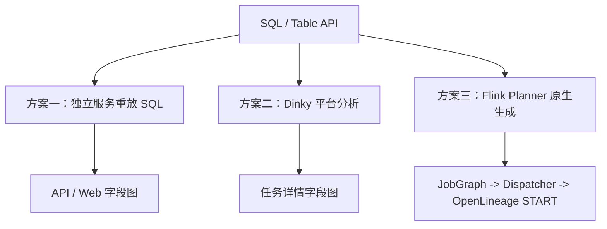
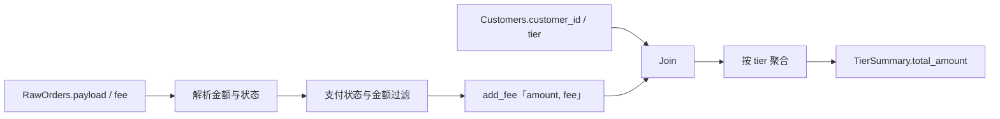
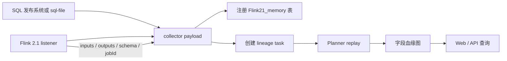
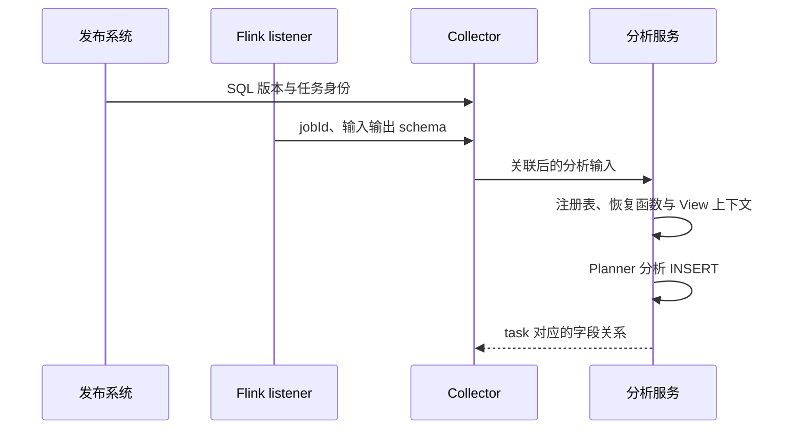
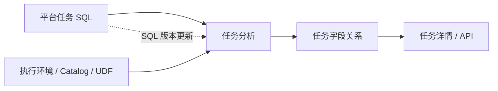

# Flink 字段血缘的三种实现：静态解析、平台分析与 Planner 原生方案

同一个 `TierSummary.total_amount`，可以在 SQL 提交前重新解析，也可以交给开发平台的分析器，还可以由 Flink Planner 在真正提交作业时直接生成关系。三种方案看起来都能画出箭头，但它们使用的语义来源、能看到的计划阶段和最终结果并不相同。

本文先给出比较总览，并用订单汇总 SQL 确定要追踪的字段关系；接着分别分析独立服务、Dinky 和原生 Flink 的设计与产出；最后比较三者在语义上下文、字段依赖和作业交付上的差异。各方案都按“输入从哪里来、怎样分析、结果能说明什么”展开。

## 一、总览：三种方案分别在哪一层计算血缘



| 方案 | 关系在什么时候计算 | 计算依据 | 结果交付位置 | 设计代价 |
| --- | --- | --- | --- | --- |
| `flink-sql-lineage` | 作业事件到达后 | listener schema + 外部保存的 SQL + replay Planner | 独立服务 API/Web | 必须重新构造 Catalog、函数和 SQL 上下文 |
| Dinky | Studio 校验或任务分析阶段 | 平台保存的作业、执行环境和 Planner | Dinky 任务详情/API | 结果依赖平台版本、JAR 和执行环境 |
| Flink + OpenLineage | 提交作业的 Planner 阶段 | 本次提交实际使用的 RelNode/RexNode 和优化后的 sink | JobGraph、Dispatcher、OpenLineage 事件 | 需要 Flink 核心传输和 listener 协议支持 |

后文围绕这三个位置展开。这里的“原生”描述提取和交付发生的位置，字段依赖本身仍通过计划静态推导，并不逐条追踪运行中的数据记录。

## 二、用同一条业务链路确定比较对象

三种方案都使用下面这条业务链路：解析订单 JSON，过滤已支付订单，用 `add_fee` 计算净金额，与客户表 Join，再按客户等级聚合。



目标关系不是“找出 SQL 中出现过的列”，而是区分：

| 输出字段 | 预期关系 | 关系角色 |
| --- | --- | --- |
| `TierSummary.tier` | `Customers.tier` | 值来源，且参与分组 |
| `TierSummary.total_amount` | `RawOrders.payload`、`RawOrders.fee` | `DIRECT` 值依赖；`payload` 也参与过滤 |
| `TierSummary.total_amount` | `RawOrders.customer_id`、`Customers.customer_id` | Join 条件带来的 `INDIRECT` 依赖 |
| `TierSummary.total_amount` | `Customers.tier` | 分组和客户过滤带来的 `INDIRECT` 依赖 |
| `TierSummary.order_count` | 输入行集合 | `SYSTEM` 聚合结果，不能伪造普通字段值来源 |

后面的比较都以这组语义为准。某个工具如果只给出 `RawOrders → TierSummary`，它完成的是表级关系；如果把 `payload`、`fee`、Join 键和分组字段列出，但不区分角色，仍然不能与 Planner 原生结果等价。

### 2.1 追踪 `total_amount` 的值来源和条件依赖

关注字段是 `TierSummary.total_amount`。业务逻辑是：从订单 JSON 读取金额，过滤已支付订单，用 UDF 加上费用，与客户等级 Join，再按等级求和。

三条路线都要回答同一个问题：

```text
TierSummary.total_amount
  <- RawOrders.payload（提供 JSON amount，同时参与 status/amount 过滤）
  <- RawOrders.fee（UDF 参数，值依赖）
  <- RawOrders.customer_id / Customers.customer_id（影响 Join 匹配）
  <- Customers.tier（影响客户过滤与分组）
```

这里描述的是业务语义，不预设三套工具一定使用相同的图形或标签：`payload` 同时承担值来源和行过滤条件，`tier` 影响分组，但它作为输出值来源只对应另一个输出字段 `TierSummary.tier`。

### 2.2 案例 SQL

自研 Flink 测试使用 `TestValuesTableFactory` 和临时 View；独立服务和 Dinky 不一定使用同一个 connector，因此这里先给出业务语义，再分别说明各自的表注册方式。

```sql
CREATE VIEW ParsedOrders AS
SELECT order_id, customer_id, fee,
  CAST(JSON_VALUE(payload, '$.amount') AS BIGINT) AS amount,
  JSON_VALUE(payload, '$.status') AS order_status
FROM RawOrders;

CREATE VIEW PaidOrders AS
SELECT order_id, customer_id, add_fee(amount, fee) AS net_amount
FROM ParsedOrders
WHERE order_status = 'paid' AND amount IS NOT NULL;

CREATE VIEW EnrichedOrders AS
SELECT o.order_id, c.tier, o.net_amount
FROM PaidOrders o
JOIN Customers c ON o.customer_id = c.customer_id
WHERE c.tier <> 'blocked';

INSERT INTO TierSummary
SELECT tier, SUM(net_amount), COUNT(order_id)
FROM EnrichedOrders
GROUP BY tier;
```

输入数据和 UDF 定义必须随路线记录。不能把 `add_fee` 悄悄替换成普通加法后，仍然声称验证了 UDF 链路。

## 三、独立服务：重建上下文，再计算字段关系

这个方案把字段血缘当成独立分析任务。Flink listener 上报 schema 和作业身份，发布系统补齐完整 SQL，collector 在服务端注册临时表后重新运行 Flink 2.1 Planner。它的核心设计是“运行事实 + SQL 版本”拼成一次可重放的分析输入。



### 设计与结果

服务端收到的不是一个已经完成的 column lineage graph，而是两类原材料：输入输出 schema，以及可重放的 SQL。它可以重新计算 `payload` 的 JSON 提取、`add_fee` 参数和 Join 条件，因此对普通投影、过滤、Join、聚合可以得到字段关系。

在本案例中，理想的 API 结果应至少包含 `RawOrders.payload`、`RawOrders.fee`、两个 Join 键和 `Customers.tier`。但这些关系描述的是 replay Planner 的结果；如果生产提交时使用了临时 View、不同 UDF 版本或不同 Catalog，回放图就可能与真实执行计划不同。这个差异是方案设计本身带来的，不是接口格式能补救的。

### 从采集事件到分析结果

服务入口接收作业身份、输入输出 schema 和发布系统保存的 SQL。随后注册临时表、保存任务文本，再按语句顺序处理 View、函数和 INSERT。最终图来自这次分析任务，listener 的原始 JSONL 只是分析输入。



其中最难保持一致的是上下文。即使 SQL 文本没变，函数 JAR 或 Catalog 发生变化，也可能得到另一份计划；缺少函数注册时，分析甚至无法完成。该方案适合集中管理分析任务，但需要保存足够的信息，才能将结果归属到某次作业提交。

这些步骤对应 [LineageCollectServiceImpl](https://github.com/Xuxiaotuan/flink-sql-lineage/blob/flink2.1/lineage-server/lineage-server-application/src/main/java/com/hw/lineage/server/application/service/impl/LineageCollectServiceImpl.java)。仓库提供了分析入口；本系列尚未保存这条复杂案例的一份完整 API 返回，前面的字段集合是比较目标，不能当作该服务的实测输出。

## 四、Dinky：在平台任务上下文中分析血缘

Dinky 是 Flink 开发与运维平台，字段血缘属于平台任务分析能力。Dinky 1.1 文档说明，Local 执行模式可以用于语法校验、查看 JobPlan 和字段级血缘，任务详情的“SQL 血缘”区域展示任务的表级和字段级关系。

### 设计与结果

Dinky 把 SQL、执行环境、connector 和 UDF 放在同一个平台上下文里，再由平台的 Planner 分析任务。相比独立服务，它少了一层手工 collector 和 SQL 关联；相比原生 Flink，它仍然是平台侧分析结果，不是随 JobGraph 传到 Dispatcher 的 lineage payload。

对本案例，需要检查 Dinky 是否将 `TierSummary.total_amount` 展开到 `RawOrders.payload`、`RawOrders.fee`、Join 键和 `Customers.tier`。实际显示粒度取决于部署版本和依赖是否完整，尤其是 `add_fee`、JSON 函数和 connector JAR。当前项目没有保存一份同一 fixture 的 Dinky 页面或 API 返回，因此这里给出的是方案设计与预期结果，不把它写成已完成的现场验收。

### 平台管理了上下文，但仍需核对关系语义

Dinky 保存任务 SQL 和执行环境，使用者可以在任务详情查看表级、字段级图。这里的优势是分析结果与开发任务放在一起，定位修改过的 SQL、函数配置和依赖比独立收集事件更直接。

不过，页面上出现“字段血缘”并不能说明它采用了与本系列相同的依赖分类。比较 `total_amount` 时，需要分别检查值来源、Join 条件、过滤条件和分组字段，不能仅凭连线数量判断准确性。比如去掉 `add_fee` 的 `fee` 参数后，值依赖应该随之改变；客户等级仍参与分组，则不能跟着一起删掉。



[Dinky 1.1 任务详情文档](https://www.dinky.org.cn/docs/1.1/user_guide/devops_center/job_details/)提供了血缘展示入口；该入口本身不能证明上述复杂 SQL 的所有间接依赖均已覆盖。本文暂不对 Dinky 的这组字段集合下实测结论。

## 五、原生 Flink：在提交链路生成并交付关系

这条路径是本系列的自研方案。它把字段关系计算放进 Flink Planner：Extractor 在 RelNode/RexNode 上生成字段和值集合，PlanBinder 把关系绑定到优化后的 sink，版本化 payload 写进 JobGraph，Dispatcher 恢复后由 OpenLineage listener 生成 `columnLineage` facet。

### 设计与结果

这条链路使用的是本次提交真正经过的 Planner 语义，因此不需要把原始 SQL、临时 View、函数注册和 connector schema 再拼一遍。它同时保留两个层次：字段值依赖（`DIRECT`）和过滤、Join、分组带来的行集合依赖（`INDIRECT`）。`COUNT(*)` 通过 `SYSTEM` 和行依赖表达，不伪造输入字段。

在本案例中，`START` 事件的 `columnLineage` 可以把 `TierSummary.total_amount` 连接到 `RawOrders.payload`、`RawOrders.fee`、两个 Join 键以及 `Customers.tier`，并带上 `FILTER`、`JOIN`、`GROUP_BY`、`AGGREGATION` 等处理标签。它还可以沿 JobGraph 到远端 Dispatcher；这正是前两种“重新分析 SQL”方案没有的交付路径。

方案的边界也必须按实现说清楚：OpenLineage JAR 本身不会给未修改的 Flink 增加 Planner 字段关系；复杂 RelNode、connector-specific Catalog 元数据和未覆盖的 SQL 语义仍需要单独定义或标记不可用。

### 事件中的字段关系

本项目这组事件记录将字段关系放在 OpenLineage `START` 的 `columnLineage` facet 中。另一个发行包验收案例采用 `Orders.amount + Orders.fee`，输出到 `Summary.total_amount`；它省去了 JSON 和 UDF，因此要与前面的复杂案例分开解释。该案例的关系摘录如下：

```text
输出：`default_catalog`.`lineage_acceptance`.`Summary`.total_amount（脚本验收目标）
输入：Orders.amount(DIRECT)、Orders.fee(DIRECT)、
      Orders.customer_id(INDIRECT)、Customers.customer_id(INDIRECT)、
      Customers.tier(INDIRECT)
转换描述：AGGREGATION,FILTER,JOIN,GROUP_BY
```

这是一段输出字段关系摘录；完整事件还包含 dataset namespace、schema、表级边以及其他输出字段。

### 保存计划后，关系是否还在

下面切换到双 sink 扩展 fixture：除了前面的 `TierSummary`，还写入 `OrderDetail`。这个扩展 fixture 保存计划、删除临时 View 后再恢复执行；direct 和 restored 的历史 START 快照规范化后关系集合相等，两个 sink 的结果断言分别为：

```text
OrderDetail: (1,gold,105), (4,silver,305), (6,gold,55)
TierSummary: (gold,160,2), (silver,305,1)
```

这些数值来自长会话 MiniCluster 测试及历史事件记录。[ColumnLineageLongSessionE2ETest](https://github.com/Xuxiaotuan/OpenLineage/blob/352a1e633219c6fcd5008aaf92def4c91331b17c/integration/flink/flink2/src/test/java/io/openlineage/flink/listener/ColumnLineageLongSessionE2ETest.java)将直接执行、保存计划恢复和字段提取失败放在同一组测试中。历史报告记录 5 个测试、0 个失败、0 个错误；对应事件是 2026-09-07 的产物，未记录两个仓库的提交 SHA，因此只能作为历史验证记录，不能冒充本文固定版本的新一轮运行。

另一个双 sink 案例使用互不相关的 `IndependentA → IndependentX` 和 `IndependentB → IndependentY`，检查是否出现交叉边。它与上述结果互补：前者检查恢复后关系是否保留，后者检查多输出之间是否发生串边。

### 字段关系不可用时，事件表达什么

如果字段提取失败，事件会保留表级关系，同时把字段级状态标为 `UNAVAILABLE` 并附带 issue。使用者应把它当作“本次作业字段图不完整”，而不是把空字段集合当成“没有上游表”。

## 六、如何比较结果与选择方案

前三节分别说明了关系的生成方式。最后把分析上下文、结果归属和使用成本放在一起看，先比较接入，再比较字段语义。

### 6.1 接入与维护成本

| 实践问题 | flink-sql-lineage | Dinky | 改造后的 Flink |
| --- | --- | --- | --- |
| 从哪里发起 | collector/API 或回放脚本 | Studio/任务详情 | Flink 作业提交 |
| 必须准备什么 | SQL、schema、Catalog、Planner 版本 | 作业、执行环境、connector、UDF | 定制 Flink、OpenLineage JAR、listener、transport |
| SQL 从哪里来 | 配置文件或发布系统 | 作业内容 | 本次提交使用的 Planner |
| 在哪里看到结果 | API/Web 或回放后的 task | SQL 血缘页面/API | OpenLineage `START` 事件 |
| 修改 SQL 后怎样更新 | 再次提交 payload/replay | 保存新版本并重新分析 | 提交新作业并产生新事件 |
| 最容易出错的关联 | SQL 与 listener schema/jobId 不匹配 | 环境或依赖不完整 | JAR/版本/远端 listener 不匹配 |

三者不是互相排斥的竞品：Dinky 可以作为开发入口，独立服务可以做跨作业分析，原生事件可以把最终提交计划的关系交给外部系统。把 Dinky 提交到定制 Flink 并统一消费原生事件是可能的集成方向，但当前没有完成该组合的现场验证，不能写成已经兼容。

### 6.2 同一字段的语义与证据

把 `TierSummary.total_amount` 放在一起比较，差异更直观：

| 观察项 | 独立服务重放 SQL | Dinky 平台分析 | Planner 原生事件 |
| --- | --- | --- | --- |
| 是否使用本次作业的真实优化计划 | 不一定，使用服务端 replay 计划 | 取决于平台分析时使用的执行环境 | 是，关系在提交端 Planner 生成 |
| `payload`、`fee` 的值依赖 | 在 SQL、schema、函数上下文完全一致时可得到 | 依赖平台函数和 connector 配置 | 直接从 `RexNode`/RelNode 计划得到 |
| Join 键、过滤字段、分组字段 | 需要 replay 规则主动传播 | 由平台实现决定 | 作为 `INDIRECT` 行集合依赖传播 |
| `COUNT(*)` | 取决于 replay 分析器是否保留系统来源 | 取决于平台展示模型 | `SYSTEM` + 行依赖，有测试约束 |
| 远端 Dispatcher 是否能直接消费 | 不能，结果在独立服务 | 不能，结果在平台 | 可以，payload 随 JobGraph 传输 |
| 结果的主要风险 | SQL、schema、Catalog 或 UDF 关联错误 | 平台版本和依赖缺失 | Flink 计划算子或协议覆盖不足 |

因此三套方案的“图”不能只比较箭头数量。独立服务解决的是离线回放和跨作业查询，Dinky 解决的是开发与运维平台中的任务分析，Planner 原生方案解决的是提交时语义和远端事件的一致交付。它们可以组合，但职责不同：平台可以调用独立服务做补充分析，也可以消费原生事件；这不意味着三者输出天然相同。

对本文案例，最小的验收结果可以写成下面这样：

```text
方案一：API 返回 total_amount 的字段关系；结果依赖 replay SQL、schema、Catalog、UDF 是否与提交时一致。
方案二：Dinky 任务详情显示 total_amount 的字段关系；结果依赖平台执行环境和版本。
方案三：OpenLineage START.columnLineage.fields 包含 payload、fee、Join 键和 tier 的关系，并保留 DIRECT/INDIRECT、SYSTEM、transformation 标签。
```

这个对比也说明为什么本项目的核心工作不是再做一个 SQL 页面，而是把 column lineage 作为 Flink 计划的一部分生成、绑定、传输和恢复。前两种方案仍然有实际价值，但它们不能替代这条提交链路。

## 参考入口

- [flink-sql-lineage README](https://github.com/Xuxiaotuan/flink-sql-lineage/blob/flink2.1/README.md)
- [ColumnLineageLongSessionE2ETest.java](https://github.com/Xuxiaotuan/OpenLineage/blob/352a1e633219c6fcd5008aaf92def4c91331b17c/integration/flink/flink2/src/test/java/io/openlineage/flink/listener/ColumnLineageLongSessionE2ETest.java)
- [Dinky SQL 血缘文档](https://www.dinky.org.cn/docs/1.1/user_guide/devops_center/job_details/)
- [Dinky 执行环境文档](https://www.dinky.org.cn/docs/1.1/user_guide/studio/execute_env_config/)
