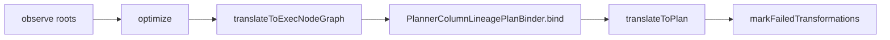
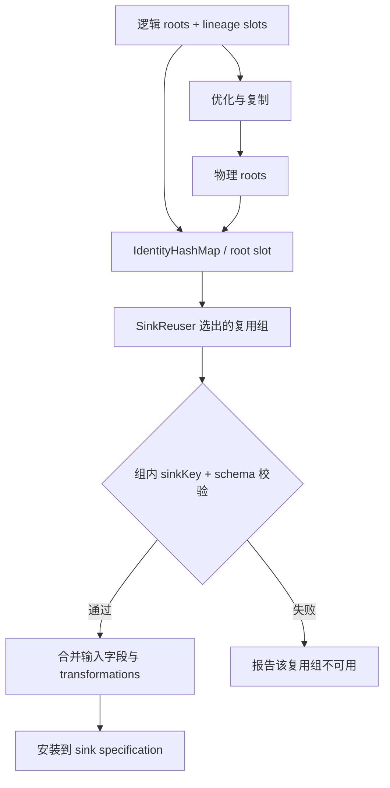

# Flink 字段血缘的实现：从 RelNode 到可传输关系

第一篇解释了为什么把关系放进 Planner。这一篇跟着代码走一遍：关系怎样从 RelNode 递归出来，怎样绑到 sink，最后怎样进入提交载荷。源码以 Flink 分支 `b5580495e00b16e81563f779737dd3359ee1f988` 为参照；行号会随提交变化，链接固定到文件和方法名。

本文沿一条关系的生命周期阅读源码：先定位 Planner 中的接入点，再进入字段依赖的递归计算；随后看优化后的 sink 绑定，最后看关系如何写进 JobGraph 并被 OpenLineage 消费。聚合和 sink reuse 的测试放在对应实现之后，便于对照代码判断结果。

### 这一实现站在什么基础上

`HamaWhiteGG/flink-sql-lineage` 已经提供了基于 Flink/Calcite 计划分析字段来源的工程基础；你的 fork 又增加了 listener、schema/SQL 关联和 replay Planner 的接入方式。本篇不把原项目已有能力抹掉，也不在没有逐文件 diff 的情况下断言每个类是“复用”还是“重写”。阅读源码时只区分三件事：已有的计划分析思路，fork 中的作业事件接入，以及 Flink 核心侧新增的绑定、传输和恢复边界。

参考：[原始项目](https://github.com/HamaWhiteGG/flink-sql-lineage)、[你的 fork](https://github.com/Xuxiaotuan/flink-sql-lineage/tree/flink2.1)。

## 一、总览：一条字段关系经过哪些组件

字段观察不是独立的 SQL 解析器，也不是把 `RelNode` 直接交给 listener。提交阶段的顺序是：



`PlannerBase` 在生成执行节点图后调用 binder；binder 将逻辑 root 的 lineage slot 与优化后的物理 root 对齐，再把结果挂到提交侧的 sink specification。血缘观察参与规划，但不替换 `translateToPlan`，也不改变 Flink 的执行节点语义。

相关源码：

- [PlannerColumnLineageExtractor.java](https://github.com/Xuxiaotuan/flink/blob/b5580495e00b16e81563f779737dd3359ee1f988/flink-table/flink-table-planner/src/main/java/org/apache/flink/table/planner/lineage/PlannerColumnLineageExtractor.java)
- [PlannerColumnLineagePlanBinder.java](https://github.com/Xuxiaotuan/flink/blob/b5580495e00b16e81563f779737dd3359ee1f988/flink-table/flink-table-planner/src/main/java/org/apache/flink/table/planner/lineage/PlannerColumnLineagePlanBinder.java)

下面的代码摘录均来自上述固定提交；为适合正文，省略了非关键分支、局部变量声明和完整异常消息，语义对应关系不变。

## 二、提取阶段：从关系节点算出字段依赖

从调用链进入提取器，首先需要理解它在递归过程中保存什么。下面先看状态模型，再看入口与算子处理，最后用聚合 SQL 将这些规则连起来。

### 2.1 内部模型与合并规则

一个输出字段可以有多条输入字段关系。输入字段由 dataset、字段名和依赖类型共同标识；同一字段以 `DIRECT` 和 `INDIRECT` 两种角色出现时，不能只按 dataset/字段名去重。

可以把一个字段的状态写成：

```text
FieldLineage = {
  inputFields: Set<InputField>,
  transformations: Set<Transformation>,
  origin: INPUT_FIELDS | CONSTANT | SYSTEM
}
```

`origin` 和输入字段的 `dependencyType` 是两个维度：`origin` 只表示输出值来自输入字段、常量还是系统机制；每个 `InputField` 自己带 `DIRECT` 或 `INDIRECT`，表示该字段怎样影响输出。`merge` 做的是集合合并而不是字符串拼接：输入字段取并集，转换标签取并集，来源按规则升级。`SYSTEM` 表示结果由行集合、系统值或聚合机制产生；它不等于“没有依赖”。`RexLiteral` 是表达式中的常量节点，`RelNode` 则是关系运算节点，两者不能混写成“常量 RelNode”。

这里有三个层次，不能用一个 `FieldLineage` 对象把它们混为一谈：

- `FieldLineage` 保存单个字段的值来源、输入 dataset、输入字段和转换标签；
- `NodeLineage` 保存一整个节点的字段集合，以及 Filter、Join、Group By 带来的节点级行依赖；
- 可用性和诊断由 binder、transport 及事件层按 root、sink group 或输出 dataset 的粒度管理，不是 `FieldLineage.merge` 自动推导出的字段属性。

因此，Filter 的条件先进入 `NodeLineage.rowDependencies`；组装最终输出关系时，`toRelation` 再把这组行依赖与字段自身的值依赖合在一起。

`FieldLineage.merge` 的关键实现如下：

```java
private void merge(FieldLineage other) {
    sources.addAll(other.sources);
    addInputs(inputs, other.inputs);
    transformations.addAll(other.transformations);
    if (hasDirectInput()) {
        origin = PlannerColumnLineageOrigin.INPUT_FIELDS;
    } else if (origin == PlannerColumnLineageOrigin.SYSTEM
            || other.origin == PlannerColumnLineageOrigin.SYSTEM) {
        origin = PlannerColumnLineageOrigin.SYSTEM;
    }
}
```

源码位置：[FieldLineage.merge](https://github.com/Xuxiaotuan/flink/blob/b5580495e00b16e81563f779737dd3359ee1f988/flink-table/flink-table-planner/src/main/java/org/apache/flink/table/planner/lineage/PlannerColumnLineageExtractor.java#L870-L882)。注意 `dependencyType` 在 `PlannerColumnLineageInput` 中参与输入去重，不能被 `origin` 替代。

### 2.2 Extractor 的入口与关系算子分派

`PlannerColumnLineageExtractor.extract` 先从 sink root 展开 scan，再调用 `extractNode`。提取结果会校验输出字段数，最后把各输出位置已有的字段状态与节点级行依赖合并，组装成对应 sink 字段的 `PlannerColumnLineageRelation`，同时保留 source dataset 和 sink key。

```text
extract(sinkRoot)
  -> expand scans
  -> extractNode(root)
  -> verify row type / field count
  -> relation[i] = node field i + output field i
```

`extractNode` 的分派规则如下：

| RelNode | 主要语义 | 结果中保留的依赖 |
| --- | --- | --- |
| TableScan | 建立 dataset 与字段身份 | 对应源字段，通常为 DIRECT |
| Project | 递归分析每个表达式 | 表达式输入和操作标签 |
| Calc | 合并 projection 与 condition | projection 输入加 FILTER |
| Filter | 不改变字段值 | 保留原有值依赖；条件引用字段作为 INDIRECT 行依赖传播 |
| Join | 左右输入按条件合并 | 投影字段、Join 条件和两侧 dataset |
| Aggregate | 聚合参数、group key、filter | 参数 DIRECT，分组/过滤 INDIRECT |
| Window | 窗口参数和时间字段 | 行集合与窗口边界依赖 |
| Union | 合并同位置输入 | 各分支同位置的值来源合并 |
| Intersect/Minus | 依据成员资格筛选集合 | 保留值来源，并传播影响成员资格的行依赖 |
| Values | 无上游 dataset | CONSTANT / SYSTEM |

入口先展开 scan，再递归计算节点，最后按 sink 输出字段位置组装关系：

```java
public static PlannerSinkColumnLineage extract(
        String sinkKey, List<String> outputFields, RelNode relNode) {
    final RelNode expandedRelNode = relNode.accept(new ExpandTableScanShuttle());
    final NodeLineage nodeLineage =
            new PlannerColumnLineageExtractor(Collections.emptyMap())
                    .extractNode(expandedRelNode);
    if (outputFields.size() != nodeLineage.fields.size()) {
        throw new TableLineageExtractionException("...field count mismatch...");
    }
    final List<PlannerColumnLineageRelation> relations = new ArrayList<>();
    for (int i = 0; i < outputFields.size(); i++) {
        relations.add(nodeLineage.fields.get(i).toRelation(
                outputFields.get(i),
                nodeLineage.rowDependencies,
                nodeLineage.rowTransformations));
    }
    return new PlannerSinkColumnLineage(
            sinkKey, outputFields, new ArrayList<>(nodeLineage.sources), relations);
}
```

源码位置：[extract](https://github.com/Xuxiaotuan/flink/blob/b5580495e00b16e81563f779737dd3359ee1f988/flink-table/flink-table-planner/src/main/java/org/apache/flink/table/planner/lineage/PlannerColumnLineageExtractor.java#L89-L116)。`rowDependencies` 会把 Filter、Join、Group By 等行集合影响补到每个输出字段，而不是只返回表达式中的列。

`Filter` 只分析条件表达式，并将条件作为行依赖传播：

```java
private NodeLineage extractFilter(Filter filter) {
    final NodeLineage input = extractNode(filter.getInput());
    return input.withRowDependency(
            lineageFromExpression(filter.getCondition(), input, filter.getVariablesSet()),
            PlannerColumnLineageTransformation.FILTER);
}
```

源码位置：[extractFilter](https://github.com/Xuxiaotuan/flink/blob/b5580495e00b16e81563f779737dd3359ee1f988/flink-table/flink-table-planner/src/main/java/org/apache/flink/table/planner/lineage/PlannerColumnLineageExtractor.java#L239-L245)。

### 2.3 表达式与聚合怎样读取字段状态

Aggregate 的输入 ordinal 必须对应聚合调用的参数位置，不能用输出字段 ordinal 代替。实现会检查聚合调用数量和输入 lineage 数量；不一致时标记该 transformation 失败，而不是把相邻字段错配。

Window 与 Aggregate 类似，但还要校验窗口输入、时间属性和窗口产生的输出数量。窗口边界可以影响行集合，因此不应只把窗口函数参数当成唯一来源。

Rex 表达式递归区分三类节点：

```text
RexInputRef  -> 从当前 RelNode 输入槽读取 FieldLineage
RexCall      -> 合并所有操作数并添加操作标签
RexLiteral   -> CONSTANT，不虚构输入 dataset
```

源码中的表达式 visitor 会区分常量、普通调用、CAST、UDF 和无操作数的系统值：

```java
@Override
public FieldLineage visitLiteral(RexLiteral literal) {
    return FieldLineage.constant();
}

@Override
public FieldLineage visitCall(RexCall call) {
    final FieldLineage field =
            call.getOperands().isEmpty() ? FieldLineage.system() : new FieldLineage();
    for (RexNode operand : call.getOperands()) {
        field.merge(operand.accept(this));
    }
    if (call.getKind() == SqlKind.CAST) {
        field.transformations.add(PlannerColumnLineageTransformation.CAST);
    } else if (call.getKind() == SqlKind.OTHER_FUNCTION) {
        field.transformations.add(PlannerColumnLineageTransformation.UDF);
    } else {
        field.transformations.add(PlannerColumnLineageTransformation.EXPRESSION);
    }
    return field;
}
```

源码位置：[Rex visitor](https://github.com/Xuxiaotuan/flink/blob/b5580495e00b16e81563f779737dd3359ee1f988/flink-table/flink-table-planner/src/main/java/org/apache/flink/table/planner/lineage/PlannerColumnLineageExtractor.java#L568-L608)。`CASE`、`ROW`、窗口和子查询在完整代码中有单独分支，不能用这段摘录替代全部规则。

UDF 的调用节点可以保留其参数字段和 `UDF` transformation。这里的 `UDF` 是提取器按 `SqlKind.OTHER_FUNCTION` 归类出的 transformation 标签；它与业务上“用户自定义函数”的范围是否完全一致，还要结合完整的函数识别规则理解。无法从 Flink 计划知道函数内部是否读取外部系统，因此不把函数内部副作用扩展成虚构的表关系。

### 2.4 用 `gross_amount` 串起状态变化与测试

以下是第一篇 SQL 的算法推演。字段集合是模型状态，不是某次事件的原始 JSON。

| 阶段 | 输出字段状态 | 为什么 |
| --- | --- | --- |
| `TableScan(orders)` | `price→orders.price(DIRECT)`；`quantity→orders.quantity(DIRECT)`；`customer_id→orders.customer_id(DIRECT)`；`region→orders.region(DIRECT)` | scan 建立 dataset 和字段槽位 |
| `price * quantity` | 两个输入均保留，增加 `EXPRESSION` | RexNode 递归访问两个 input ref |
| `WHERE region='CN'` | 输出字段继续保留；`region` 加 `FILTER`/`INDIRECT` | 条件改变参与计算的行集合 |
| `GROUP BY customer_id` | `customer_id` 作为分组依赖传播到聚合输出 | 分组改变行到结果组的归属 |
| `SUM(...)` | `price`、`quantity` 保留 `DIRECT`；增加 `AGGREGATION` | 聚合参数决定数值 |
| sink bind | `gross_amount` 绑定到实际 sink 字段位置 | 不能停留在优化前的临时投影 |

`COUNT(*)` 的规则更特殊。当前已有 planner 测试 `testExtractsAggregateGroupByAndCountStar` 覆盖 `GROUP BY` 场景：count 的 origin 是 `SYSTEM`，同时保留分组字段的间接依赖。`testAggregateConstantArgumentsRetainExactRowDependencies` 还覆盖了常量参数和带过滤的 count，说明过滤字段仍会被保留。

测试不是放在实现之后才补的一张结果表，它直接约束上面的状态转移：

```java
final PlannerSinkColumnLineage lineage =
        extract(
                "sink-aggregate",
                "SELECT b, SUM(a), COUNT(*) FROM FirstTable GROUP BY b",
                "group_b", "total_a", "row_count");

final PlannerColumnLineageRelation group = relation(lineage, "group_b");
assertThat(group.getOrigin()).isEqualTo(PlannerColumnLineageOrigin.INPUT_FIELDS);
assertInputs(group, "FirstTable.b:DIRECT", "FirstTable.b:INDIRECT");
assertThat(group.getTransformations())
        .contains(PlannerColumnLineageTransformation.GROUP_BY);

final PlannerColumnLineageRelation count = relation(lineage, "row_count");
assertThat(count.getOrigin()).isEqualTo(PlannerColumnLineageOrigin.SYSTEM);
assertInputs(count, "FirstTable.b:INDIRECT");
assertThat(count.getTransformations())
        .contains(PlannerColumnLineageTransformation.AGGREGATION)
        .contains(PlannerColumnLineageTransformation.GROUP_BY);
```

这段断言把 `SYSTEM`、`INDIRECT` 和 `GROUP_BY` 同时锁住了：`COUNT(*)` 没有虚构输入值字段，但仍然依赖分组形成的行集合。常量聚合测试还断言 `SUM(1)` 保持 `SYSTEM`，`COUNT(*) FILTER (WHERE c = 'ok')` 同时包含 `b` 和 `c` 的间接依赖。完整源码见 [PlannerColumnLineageExtractorTestBase](https://github.com/Xuxiaotuan/flink/blob/b5580495e00b16e81563f779737dd3359ee1f988/flink-table/flink-table-planner/src/test/java/org/apache/flink/table/planner/plan/common/PlannerColumnLineageExtractorTestBase.java#L278-L335)。

本分支没有把“无分组、无过滤的裸 `COUNT(*)`”当作已经运行过的事件案例。根据实现规则，它应表达输入表的行集合依赖，并以 `SYSTEM` 区分没有普通输入字段的计数；要把它写成最终事件结论，还需要单独的端到端断言。

## 三、绑定阶段：让逻辑关系跟上优化后的 sink

到这里，提取器已经知道每个输出位置依赖什么。接下来的问题是优化可能改变 root 对象和 writer 数量，之前算出的关系必须跟随这些变化，才能挂到实际执行的 sink 上。

Extractor 输出的是逻辑计划上的关系，优化会复制、重排、复用 root。`PlannerColumnLineagePlanBinder` 的工作不是重新解析 SQL，而是维护身份映射。

核心步骤：

1. 为每个逻辑 root 保留一个 slot，按优化器返回的 root 顺序对齐。
2. 使用 `IdentityHashMap` 保存物理 root 到 lineage/table metadata 的对象身份关系。
3. root 复制前先保存旧 metadata，复制后按 root slot 转移，而不是用 dataset 名称猜测。
4. 同一 `sinkKey` 且输出 schema 相同的贡献才进入同一 sink group。
5. 合并同组贡献的输入字段和 transformation；任何一个贡献缺失列级关系时，该输出列级关系按不可用处理。

这些条件分别解决不同问题：对象身份防止同名 dataset 误合并，root slot 只在优化器保持 root 顺序对应、且复制/转移过程维护该约定时才可靠；实现还会检查 root 数量、sink key 和 schema，不一致就进入失败处理。sink key/schema 检查防止 StatementSet 的两个输出互相污染。`IdentityHashMap + slot` 不是对任意优化重排的自动修复。



root 对齐的关键校验来自 `bindPhysicalRootsChecked`：

```java
if (roots.size() != logicalRoots.size()
        || roots.size() != logicalLineages.size()) {
    throw failure("<unknown>", "<unknown>",
            "logical and physical writer slots cannot be aligned");
}
for (int i = 0; i < roots.size(); i++) {
    RelNode root = roots.get(i);
    RelNode logicalRoot = logicalRoots.get(i);
    if (!(root instanceof Sink)
            || !((Sink) logicalRoot).contextResolvedTable()
                    .equals(((Sink) root).contextResolvedTable())) {
        throw failure("<unknown>", "<unknown>",
                "optimized writer changed its sink context");
    }
    if (logicalLineages.get(i) != null) {
        physicalLineages.put(root, logicalLineages.get(i));
    }
}
```

源码位置：[bindPhysicalRootsChecked](https://github.com/Xuxiaotuan/flink/blob/b5580495e00b16e81563f779737dd3359ee1f988/flink-table/flink-table-planner/src/main/java/org/apache/flink/table/planner/lineage/PlannerColumnLineagePlanBinder.java#L194-L226)。这段代码依赖优化器在调用 binder 前保持 writer root 的对应顺序，并用 sink context 校验对应关系；它不是对任意 root 重排的自动修复。

root 复制时，代码先按位置保存旧 metadata，再写入新 root：

```java
if (before.size() != after.size()) {
    throw failure("<unknown>", "<unknown>",
            "root copies changed the number of sinks");
}
for (int i = 0; i < after.size(); i++) {
    if (lineages.get(i) != null) {
        physicalLineages.put(after.get(i), lineages.get(i));
    } else {
        physicalLineages.remove(after.get(i));
    }
}
```

源码位置：[transferRootsChecked](https://github.com/Xuxiaotuan/flink/blob/b5580495e00b16e81563f779737dd3359ee1f988/flink-table/flink-table-planner/src/main/java/org/apache/flink/table/planner/lineage/PlannerColumnLineagePlanBinder.java#L233-L255)。这就是“root slot + 显式转移”的实际含义。

失败粒度需要分开看：单个 root 的 extractor 异常可以只让该 sink contribution 缺失；sink reuse group 的合并异常会清除该组 metadata；根数量、sink key 或全局对齐失败则进入更大的 failed-transformation 标记。不能把所有异常都概括成“单个 sink 隔离”。

sink reuse 的实际入口只接收已有 `SinkReuser` 选出的 group；贡献缺失时清除代表 sink 的列级关系：

```java
private void reuseSinksChecked(List<Sink> sinks) {
    final List<PlannerSinkColumnLineage> contributions = new ArrayList<>();
    for (Sink sink : sinks) {
        final PlannerSinkColumnLineage lineage = physicalLineages.get(sink);
        if (lineage == null) {
            physicalLineages.remove(sinks.get(0));
            return;
        }
        contributions.add(lineage);
    }
    physicalLineages.put(sinks.get(0), merge(contributions));
}
```

源码位置：[reuseSinksChecked](https://github.com/Xuxiaotuan/flink/blob/b5580495e00b16e81563f779737dd3359ee1f988/flink-table/flink-table-planner/src/main/java/org/apache/flink/table/planner/lineage/PlannerColumnLineagePlanBinder.java#L274-L307)。完整实现还会先合并 table-level sources，并在 `merge` 中检查 sink key 与输出 schema。

传播测试紧跟着验证优化后的实际 transformation，而不是只验证 logical plan：


```java
for (boolean[] settings : new boolean[][] {{true, true}, {false, true}, {true, false}}) {
    final boolean reuse = settings[0];
    final boolean reuseSubplans = settings[1];
    final TableEnvironmentImpl environment = createEnvironment();
    environment.getConfig().set(
            OptimizerConfigOptions.TABLE_OPTIMIZER_REUSE_SINK_ENABLED, reuse);
    environment.getConfig().set(
            OptimizerConfigOptions.TABLE_OPTIMIZER_REUSE_SUB_PLAN_ENABLED, reuseSubplans);
    createValuesTable(environment, "OtherSource", "value");
    final StatementSet statements = environment.createStatementSet();
    statements.addInsertSql("INSERT INTO LineageSink SELECT `value` FROM LineageSource");
    statements.addInsertSql("INSERT INTO LineageSink SELECT `value` FROM OtherSource");
    final CompiledPlan plan = statements.compilePlan();
    final CompiledPlan restored =
            environment.loadPlan(PlanReference.fromJsonString(plan.asJsonString()));
    final List<Transformation<?>> transformations =
            CompiledPlanUtils.toTransformations(environment, restored);
    assertThat(transformations).hasSize(reuse && reuseSubplans ? 1 : 2);
    final LineageGraph graph = LineageGraphUtils.convertToLineageGraph(transformations);
    assertThat(graph.columnRelations()).singleElement().satisfies(
            relation -> assertThat(relation.inputs())
                    .extracting(input -> input.inputDataset().name())
                    .containsExactlyInAnyOrder(
                            identifier("LineageSource").asSerializableString(),
                            identifier("OtherSource").asSerializableString()));
}
```


即使两个写入被优化成一个 transformation，最终关系仍必须保留两个 source。测试位置：[ColumnLineagePropagationTest](https://github.com/Xuxiaotuan/flink/blob/b5580495e00b16e81563f779737dd3359ee1f988/flink-table/flink-table-planner/src/test/java/org/apache/flink/table/planner/lineage/ColumnLineagePropagationTest.java#L802-L835)。

现有测试 [ColumnLineagePropagationTest.testSinkReuseConfigurationPreservesAllSourceDependencies](https://github.com/Xuxiaotuan/flink/blob/b5580495e00b16e81563f779737dd3359ee1f988/flink-table/flink-table-planner/src/test/java/org/apache/flink/table/planner/lineage/ColumnLineagePropagationTest.java) 在 sink reuse/subplan 组合下检查两个 source 的关系是否都保留，并断言合并后的 transformation 数量。它验证的是传播与复用，不是网络 Dispatcher 验收。

## 四、交付阶段：从提交图到远端事件

绑定解决了关系属于哪个 sink；提交到远端时，还要解决运行端如何读取这份关系。下面沿序列化、配置写入和事件发布三个步骤继续追踪。

### 4.1 将关系写入版本化载荷

绑定后的关系通过版本化载荷进入 JobGraph。当前实现的入口是 `LineageGraphTransport.serialize`：它把 graph 的 dataset 先放进 registry，再用整数引用写入表级边和字段关系。

```java
root.put("formatVersion", FORMAT_VERSION);
final DatasetRegistry datasets = DatasetRegistry.from(graph);
root.set("datasets", datasets.toJson(MAPPER));

final ArrayNode columns = root.putArray("columnRelations");
for (ColumnLineageRelation relation : graph.columnRelations()) {
    final ObjectNode relationNode = columns.addObject();
    relationNode.put("outputDataset", datasets.idOf(relation.outputDataset()));
    relationNode.put("outputField", relation.outputField());
    relationNode.put("origin", relation.origin().name());
    relation.transformation()
            .ifPresent(value -> relationNode.put("transformation", value));
    // each input carries dataset id, field and dependencyType
}
```

源码位置：[LineageGraphTransport.serialize](https://github.com/Xuxiaotuan/flink/blob/b5580495e00b16e81563f779737dd3359ee1f988/flink-runtime/src/main/java/org/apache/flink/streaming/api/lineage/LineageGraphTransport.java#L57-L106)。实际字段名包括 `formatVersion`、`datasets`、`relations`、`columnRelations`、`outputDataset`、`outputField`、`origin` 和 `dependencyType`。

### 4.2 随作业配置传输，在运行端恢复

写入作业配置的位置在 `StreamGraphGenerator`：

```java
streamGraph.getJobConfiguration().setString(
        LineageGraphTransport.CONFIG_KEY,
        LineageGraphTransport.serialize(observation));
```

源码位置：[StreamGraphGenerator](https://github.com/Xuxiaotuan/flink/blob/b5580495e00b16e81563f779737dd3359ee1f988/flink-runtime/src/main/java/org/apache/flink/streaming/api/graph/StreamGraphGenerator.java#L303-L312)。这一步把 binder 产出的 graph 放入作业配置，随后随着 JobGraph 提交。

Dispatcher 侧从相同配置键读取并恢复：

```java
final String lineagePayload =
        jobGraph.getJobConfiguration()
                .getString(LineageGraphTransport.CONFIG_KEY, null);
final LineageGraph lineageGraph =
        lineagePayload == null
                ? new LineageGraphObservation(..., "UNAVAILABLE", "UNAVAILABLE", ...)
                : LineageGraphTransport.deserialize(lineagePayload);
DispatcherLineageEventUtils.notifyJobCreated(
        jobStatusChangedListeners, jobId, jobName, lineageGraph, ...);
// LineageGraphTransportException is caught below; the event then receives
// another unavailable observation and execution continues.
```

运行端实际的兜底逻辑是：

```java
} catch (LineageGraphTransportException lineageFailure) {
    log.warn("Could not restore lineage graph; execution continues.", lineageFailure);
    DispatcherLineageEventUtils.notifyJobCreated(
            jobStatusChangedListeners, jobId, jobName,
            new LineageGraphObservation(
                    DefaultLineageGraph.builder().build(),
                    "UNAVAILABLE", "UNAVAILABLE",
                    Collections.singletonList(
                            "Lineage graph payload could not be restored")),
            runtimeMode, submissionId, classLoader);
}
```

源码位置：[DefaultExecutionGraphBuilder](https://github.com/Xuxiaotuan/flink/blob/b5580495e00b16e81563f779737dd3359ee1f988/flink-runtime/src/main/java/org/apache/flink/runtime/executiongraph/DefaultExecutionGraphBuilder.java#L204-L231)。反序列化失败会记录 lineage issue 并继续执行，事件拿到的是不可用 observation；这才是“血缘失败不阻断 Flink”的实际接缝。

`LineageGraphTransport` 负责版本、dataset 引用、字段存在性和关系输入的校验；载荷缺失时，`DefaultExecutionGraphBuilder` 直接构造不可用 observation，反序列化抛出 `LineageGraphTransportException` 时，也由这个构建器捕获并构造不可用 observation。这个整体载荷失败路径会把 table/column status 都设为 `UNAVAILABLE`；它和集成层保留已知表级关系、只把字段级标为不可用的部分失败路径不是同一层。

直接执行与 Compiled Plan 恢复执行，最终都汇入上述作业配置与事件发布路径。Compiled Plan 如何保存并还原绑定所需的元数据，是进入这条路径之前的步骤；进入 Dispatcher 后，两者都从作业配置读取并发布关系。

### 4.3 映射到 OpenLineage 字段关系

OpenLineage 集成读取恢复后的 dataset、字段和 dependency type，生成 `columnLineage` facet。事件里的每条关系属于输出字段；表级 `inputs`/`outputs` 和字段级 `columnLineage.fields` 是两个层次。

当前实现能保证通用 dataset、namespace、字段和 column relations 的传输。connector-specific 的 `CatalogBaseTable` 元数据由集成侧按需要重建，不能反向证明 Flink 已经跨进程恢复完整 connector 对象。
