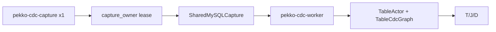
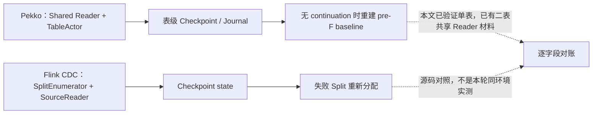
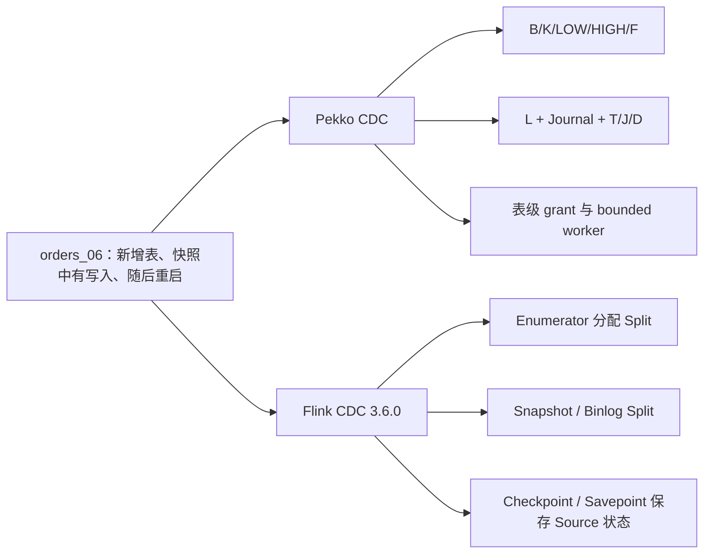
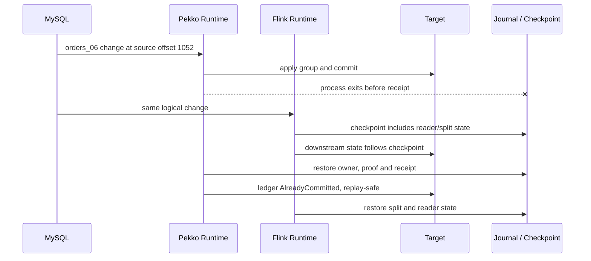

## 2026-11-22 运行时基线更新

本系列当前以 `pekko-reference` 的 `main` 分支为唯一 CDC 基线。生产部署拆成两个模块：`pekko-cdc-capture` 和 `pekko-cdc-worker`。Capture 运行一个副本并持有 `SharedMySQLCapture`。Worker 至少运行两个副本，通过 `TaskLease` 创建独立的 `TableActor` 和 materialized `TableCdcGraph`，不复制源端 Reader。


```mermaid
flowchart LR
  C[pekko-cdc-capture x1] --> L[capture_owner lease]
  L --> R[SharedMySQLCapture]
  R --> W[pekko-cdc-worker]
  W --> G[TableActor + TableCdcGraph]
  G --> T[T/J/D]
```

`pekko-server` 是共享兼容库和历史测试入口，不是第三个生产部署模块。历史源码链接和实验版本仍按原报告解释，不能用当前模块结构改写旧实验结论。

作者：xuyinyin

[系列导读](/pekko-cdc-series/) · [Pekko CDC 深入解析（一）](/2026/10/18/pekko-cdc-1-resident-tasks/) · [Pekko CDC 深入解析（二）](/2026/10/18/pekko-cdc-2-recovery-contract/) · [Pekko CDC 深入解析（三）](/2026/10/18/pekko-cdc-3-mysql-journal-experiment/) · [Pekko CDC 深入解析（四）](/2026/10/18/pekko-cdc-4-protocol-design/) · [Pekko CDC 深入解析（五）](/2026/10/18/pekko-cdc-5-flink-comparison/)

前四篇已经把 Pekko CDC 的资源、事件身份、恢复证明和 LOW/HIGH 状态机拆开。最后一篇不再问“哪个框架更好”，而是把同一张新增表放进两套运行时，比较每一条责任由谁承载。

> **源码基线**：`644d8bd`。Pekko 源码调用链按该提交阅读，Flink CDC 对照固定 `release-3.6.0`；后续提交只改变文档或验证材料，不改变本文涉及的生产实现。

案例仍然是 `orders_06`。它在一个已经运行的 MySQL capture 中加入，先完成快照，快照期间继续发生写入，再追到一个可以发布的边界。比较对象固定为 Pekko 当前实现和 Flink CDC 3.6.0 的 MySQL Source 源码。本文没有在同一机器、同一 Sink 和同一故障点重跑 Flink，因此结论只讨论状态归属、恢复路径和资源模型。


## 2026-11-22 跨 Chunk 与跨重启修订

Pekko 当前源码基线是 [`644d8bd`](https://github.com/Xuxiaotuan/pekko-reference/tree/644d8bdcc6d9721e7a08232b935793f05d70dac5)，Flink CDC 对照仍固定 `release-3.6.0`。本轮新增的事实是 Pekko 已经把跨 Chunk、读视图回滚和跨 JVM full rescan 接到表级 Checkpoint 主路径，但 `TableCdcGraphRuntime` 仍是 façade，不能把它写成已经拥有 Flink SourceReader 同等的统一 materialized Graph 运行时。


```mermaid
flowchart LR
    P["Pekko：Shared Reader + TableActor"] --> PC["表级 Checkpoint / Journal"]
    PC --> PR["无 continuation 时重建 pre-F baseline"]
    F["Flink CDC：SplitEnumerator + SourceReader"] --> FC["Checkpoint state"]
    FC --> FR["失败 Split 重新分配"]
    PR -. "本文已验证单表，已有二表共享 Reader 材料" .-> E["逐字段对账"]
    FR -. "源码对照，不是本轮同环境实测" .-> E
```

比较结论只到运行时责任边界。Pekko 目前有真实单表跨重启证据和已有两表共享 Reader 材料，足以讨论动态表级生命周期；这不是 70 万物理表容量证明，也不是与 Flink CDC 的同负载性能基准。source fence v2、L floor 跨进程恢复和长期容量曲线仍单独列为未验证范围。

## 0 先给出结论

Pekko 和 Flink CDC 都能表达“快照之后接增量”，但它们把边界放在不同位置。先把术语固定下来：Flink Checkpoint 主要服务故障恢复，保存状态和对应的流位置；Flink Savepoint 是用户触发、长期保留、面向停机恢复、升级和迁移的执行状态快照。Apache Flink 官方文档明确区分了两者的生命周期和存储目标：[Checkpoint](https://nightlies.apache.org/flink/flink-docs-stable/docs/ops/state/checkpoints/)、[Savepoint](https://nightlies.apache.org/flink/flink-docs-stable/docs/ops/state/savepoints/)、[Checkpoint vs Savepoint](https://nightlies.apache.org/flink/flink-docs-stable/docs/ops/state/checkpoints_vs_savepoints/)。

Pekko 当前实现也采用两层语义，但没有复制 Flink 的 Job 全局 barrier。表级 Checkpoint 服务于单表异常恢复；Runtime Savepoint 以 `captureEpoch` 为边界，把 Shared Reader 的 L frontier、路由集合和表级 Checkpoint 引用绑定到一个分页 Manifest。

Pekko 把 `B、K、LOW、HIGH、F、T/J/D、Schema` 拆成任务级状态，并由 Shared Reader、Journal、目标 ledger 和控制存储共同推进。它适合把表级生命周期放进一个长期运行的控制面。

Flink CDC 把快照 Split、binlog Split、Split 分配状态、Reader 状态和 Checkpoint 放进 Source API 运行时。它把恢复和并行读取做成 Job 级基础设施，适合活跃表较多、吞吐和状态后端是主导问题的场景。

先把两套系统的恢复对象对齐：

| 对象 | Pekko 当前实现 | Flink CDC 3.6.0 |
|---|---|---|
| 自动故障恢复 | 每张表的 Checkpoint/BootstrapProgress、Journal receipt、L ACK ancestry 和目标 ledger | Job Checkpoint 中的 Source split state、Reader state 与下游算子状态 |
| 运维级保存 | captureEpoch + 分页 TableCheckpointRef 的 Runtime Savepoint，首版只完成代码和本地 focused tests | 用户触发的 Savepoint，面向停机、升级和迁移 |
| 动态增删表 | TableActor 独立进入/退出，其他表的 Checkpoint 不被覆盖 | 由作业、Enumerator 和 Source 变更机制共同治理 |
| 全局原子性 | 没有跨表目标事务 barrier | Checkpoint 对作业状态提供一致快照，但不等于业务目标库跨表事务 |

这张表也解释了本文的边界：Pekko 的“很多轻量 Actor”是表级状态组织方式，Pekko 的“表级 Checkpoint”才是异常恢复主线，Runtime Savepoint 是可选的运维封装。不能拿首版 Savepoint 的本地测试替代真实 MySQL、Journal、Sink 的跨 JVM 恢复证据。

本轮真实 Checkpoint 材料进一步说明两套语义的差别。

本轮新增的单表 GRAPH 场景说明 Pekko 的可编程边界已经落到实际 materialization：每张表可以独立拥有 Source、Sink、Journal handoff 和 KillSwitch。Flink 的 SourceReader/Checkpoint 由 Job 运行时统一协调，Pekko 当前实现则把表级 Graph 生命周期交给 TableActor。该场景只覆盖单表，不是两套系统的性能比较。详见[独立 Graph 验证报告](https://github.com/Xuxiaotuan/pekko-reference/blob/0371c3f/docs/experiments/2026-11-19-table-graph/README.md)。
Pekko 的表级 Checkpoint 在真实 MySQL、JDBC Actor Journal 和事务 Sink 上完成了 7/7 指定窗口的逐字段对账；这不是 Runtime Savepoint 的跨表恢复证明，也不是 Flink Checkpoint 的性能对比。当前 Pekko 源码中 Streams 主要包住批次读取、分片并发和 Sink 边界，Actor Journal 与 Runtime worker 池仍负责控制和恢复。材料见[Checkpoint 恢复报告](https://github.com/Xuxiaotuan/pekko-reference/blob/228dba6/docs/experiments/2026-11-19-checkpoint-recovery/README.md)，既有恢复协议的源码入口固定为[472e809](https://github.com/Xuxiaotuan/pekko-reference/tree/main)，独立 Graph 的实现提交为[4fe23bf](https://github.com/Xuxiaotuan/pekko-reference/tree/ed06259)。


这不是性能结论。当前材料没有同负载 Flink benchmark，也没有 70 万真实物理表的长期容量曲线。


```mermaid
flowchart LR
    Case["orders_06：新增表、快照中有写入、随后重启"] --> P["Pekko CDC"]
    Case --> F["Flink CDC 3.6.0"]
    P --> P1["B/K/LOW/HIGH/F"]
    P --> P2["L + Journal + T/J/D"]
    P --> P3["表级 grant 与 bounded worker"]
    F --> F1["Enumerator 分配 Split"]
    F --> F2["Snapshot / Binlog Split"]
    F --> F3["Checkpoint / Savepoint 保存 Source 状态"]
```

## 1 同一张表的业务承诺

`orders_06` 的操作序列固定如下：

```text
10:00  请求订阅 orders_06
10:02  捕获边界完成
10:03  开始快照
10:05  id=7 更新，id=12 删除
10:08  快照 Split 完成
10:10  回填快照窗口内的事件
10:11  进入持续同步
10:12  在目标提交与进度持久化之间重启
```

两套系统都必须回答四个问题：

1. 快照期间的更新由谁保存。
2. 快照 Split 和增量读取在哪里交接。
3. 重启时从哪一个状态恢复。
4. 哪一条状态可以决定目标继续发布。

差异从这里开始。Pekko 把这些问题拆到多张控制表和 Journal 中。Flink 把它们收敛到 SplitEnumerator、SourceReader 和 Checkpoint state。

## 2 Flink CDC 的源码调用链

Flink CDC 3.6.0 的 MySQL Source 从 `MySqlSourceEnumerator` 开始。Enumerator 接收 Reader 的 split 请求，从 `MySqlHybridSplitAssigner` 取下一个 split，再通过 Source Coordinator 分配给具体 Reader。

```text
MySqlSourceEnumerator
  └─ MySqlHybridSplitAssigner.getNext()
       ├─ MySqlSnapshotSplitAssigner.getNext()
       │    └─ MySqlChunkSplitter.splitChunks()
       └─ MySqlBinlogSplitAssigner
  └─ addSplitsBack(...) on failure
  └─ snapshotState(checkpointId)
  └─ notifyCheckpointComplete(checkpointId)
```

`MySqlSnapshotSplitAssigner` 保存 `remainingSplits`、`assignedSplits`、表 Schema 和已完成 Split 的 binlog offset。它在所有 snapshot split 完成后，还要等待一个完整 Checkpoint，才把 snapshot assigner 标记为 finished。这个等待保证已完成的 Split 处理结果已经进入一致的 Checkpoint 边界。

`MySqlHybridSplitAssigner` 不会在 snapshot split 尚未完成时直接分配 binlog split。源码中的顺序是先返回 snapshot split，等 snapshot assigner 完成并且 finished split 信息齐全，再创建或更新 binlog split。否则同一主键的快照行和增量事件可能乱序。

`MySqlSourceReader` 的 `snapshotState(checkpointId)` 会保存未完成的 snapshot split、尚未确认的 finished snapshot split 和未完成的 binlog split。Reader 失败后，Enumerator 通过 `addSplitsBack` 把这些 split 放回待分配集合。

源码入口：

- [`MySqlSourceEnumerator.java`](https://github.com/apache/flink-cdc/blob/release-3.6.0/flink-cdc-connect/flink-cdc-source-connectors/flink-connector-mysql-cdc/src/main/java/org/apache/flink/cdc/connectors/mysql/source/enumerator/MySqlSourceEnumerator.java)
- [`MySqlSnapshotSplitAssigner.java`](https://github.com/apache/flink-cdc/blob/release-3.6.0/flink-cdc-connect/flink-cdc-source-connectors/flink-connector-mysql-cdc/src/main/java/org/apache/flink/cdc/connectors/mysql/source/assigners/MySqlSnapshotSplitAssigner.java)
- [`MySqlHybridSplitAssigner.java`](https://github.com/apache/flink-cdc/blob/release-3.6.0/flink-cdc-connect/flink-cdc-source-connectors/flink-connector-mysql-cdc/src/main/java/org/apache/flink/cdc/connectors/mysql/source/assigners/MySqlHybridSplitAssigner.java)
- [`MySqlSourceReader.java`](https://github.com/apache/flink-cdc/blob/release-3.6.0/flink-cdc-connect/flink-cdc-source-connectors/flink-connector-mysql-cdc/src/main/java/org/apache/flink/cdc/connectors/mysql/source/reader/MySqlSourceReader.java)

这些类来自 Flink CDC 的 `release-3.6.0` 源码分支。3.6.0 的发布信息和兼容范围见 Apache Flink CDC 官方仓库。[版本发布页](https://github.com/apache/flink-cdc/releases)

## 2.1 Pekko Savepoint 与 Flink Savepoint 的边界不同

Flink Savepoint 是整个 streaming job 的一致执行状态图，通常由 checkpointing 机制产生，并由稳定存储中的元数据和状态文件组成。Pekko 第一版 Runtime Savepoint 是控制库中的不可变 Manifest：它保存 Shared Reader 的 `captureEpoch`，以及每张表的 Checkpoint、Journal 和目标证据引用摘要。它不把所有表的目标事务合并成一个跨表原子提交，也不把 JDBC 连接或 ActorRef 序列化进去。

```text
Flink：Job checkpoint/savepoint
  Source state + operator state + stream positions

Pekko：Runtime Savepoint
  captureEpoch + paged TableCheckpointRef
  + T/J/D references + owner epoch
```

Pekko 的 Manifest 只有在 page digest、table-set digest 和最终 manifest digest 都可重算时才进入 `SEALED`。恢复时仍然要重新验证 source lineage、owner/guardian、L ACK ancestry、目标 ledger 和 Journal receipt。它是一层控制面索引，不是把“Manifest 已封存”当成“所有表都可以直接继续流式”。

动态增删表是两者差异最大的地方。Pekko 明确规定 Savepoint 冻结前的表进入 table set，冻结期间新增的表排队到 Savepoint 之后，已经取消的表以 tombstone 恢复。Flink 的 Source split 和作业状态则由 Job/Enumerator 变更路径治理；本文没有把动态新增表的 Flink 运行实验写成已验证结果。

## 3 Pekko 的同一条路径

Pekko 侧的调用链是另一种拆法：

```text
CdcBootstrapKernel
  └─ SharedMySQLCapture
       ├─ marker → B/K
       ├─ raw callback → L
       └─ ACK prefix → D
  └─ BootstrapRunner
       ├─ snapshot page → appliedPage
       ├─ HIGH / completion root
       └─ replay → F
  └─ BootstrapJournal + target ledger
       └─ T/J/D verification → STREAMING
```

对 `orders_06`，Pekko 的边界是：

```text
B=1000
K=1012
LOW=1018
HIGH=1048
F=1061
```

快照 page 和 L 的变更都归属于同一个 generation。目标临时表在 T/J/D 和 Schema 检查完成前不对业务发布。发生重启时，恢复入口先验证 owner、permit、Journal receipt 和 proof，再决定重放页面或继续回放 L。

Flink 的等价信息分散在 split state 和 checkpoint state 中。Pekko 没有把所有状态合成一个 Source checkpoint，而是把表级生命周期拆开。这个设计让取消一张表、新增一张表和给某一张表单独分配资源更直接，但也增加了需要自行证明的关系数量。

## 4 同一故障窗口里的恢复差异

把重启放在目标提交与进度持久化之间。


```mermaid
sequenceDiagram
    participant M as MySQL
    participant P as Pekko Runtime
    participant F as Flink Runtime
    participant T as Target
    participant J as Journal / Checkpoint
    M->>P: orders_06 change at source offset 1052
    P->>T: apply group and commit
    P--xJ: process exits before receipt
    M->>F: same logical change
    F->>J: checkpoint includes reader/split state
    F->>T: downstream state follows checkpoint
    P->>J: restore owner, proof and receipt
    P->>T: ledger AlreadyCommitted, replay-safe
    F->>J: restore split and reader state
```

Pekko 的恢复依赖多份证据重新形成关系。目标 ledger 只能证明目标是否见过某个 group identity，不能单独推进 Journal。ACK proof 只能证明 Source 前缀，不能单独证明目标提交。所有证据都属于同一 owner 和 generation 时，才允许进入下一步。

Flink 的恢复边界由 Checkpoint 统一承载 Source split state、Reader state 和下游算子状态；Savepoint 则面向用户触发的停机、升级、迁移和重部署。`MySqlSourceEnumerator` 从保存的 pending state 重建 Split，Reader 从 checkpoint 恢复未完成 split。这个模型减少了业务代码需要手工组合的持久化对象，但动态表目录的加入和取消仍然需要通过作业与 Source 运行时的变更机制治理。

## 5 两套系统各自解决了什么

| 责任 | Pekko CDC | Flink CDC 3.6.0 |
|---|---|---|
| 表的订阅意图 | `B`、generation、控制存储 | Source 配置和 Split 生命周期 |
| 快照拆分 | `BootstrapRunner` 的范围窗口和 page receipt | `MySqlChunkSplitter` 和 snapshot split |
| 快照到增量 | `LOW/HIGH/F`、L 回放 | hybrid split 和 finished split offset |
| Source 进度 | L、ACK proof、D | Enumerator/Reader checkpoint state |
| 目标幂等 | group ledger、T/J receipt | 由具体 Sink、状态和提交协议决定 |
| 资源准入 | grant、snapshot/tail worker 上限 | Source 并行度、slot 和 backpressure |
| 单表取消 | 任务级 STOP、排空和释放 | 需要通过作业或 Source 变更路径处理 |
| 运行时恢复 | guardian、owner fence、Journal | JobManager、TaskManager、Checkpoint |

这个表描述的是责任归属。它不把任一边的所有连接器都自动升级成相同的端到端语义。

## 6 证据如何支持比较

Pekko 当前材料覆盖：

- 真实 MySQL Reader 的事件身份和 ACK 顺序。
- 目标先提交、Journal 后推进的固定重启窗口。
- LOW/HIGH、B/F 和多 Chunk 的固定故障矩阵。
- Actor Journal、MySQL Sink 和逐字段对账。
- proof 分页、保护引用和小批量 GC。

Flink 侧本文使用 3.6.0 源码调用链和公开运行模型。没有同数据集、同 Sink、同故障点的实时重跑，因此下面这些结论没有证据支持：

```text
Pekko 比 Flink 吞吐更高
Pekko 比 Flink 连接更少
Pekko 比 Flink 更可靠
Flink 一定能自动处理所有动态表变更
```

当前可以确认的是运行时责任不同。Pekko 把表级状态和生命周期拆到控制面，Flink 把 Split、Reader 和 Checkpoint 交给统一 Source 运行时。

## 7 适用场景

Pekko 更适合这些主导矛盾：

- 一个 MySQL 实例有很大的表目录，但日常只有少量活跃表。
- 新增和取消表需要不停已有 capture。
- 任务需要表级暂停、恢复和资源准入。
- 团队愿意维护事件身份、目标 ledger 和恢复证明。

Flink CDC 更适合这些主导矛盾：

- 活跃表和事件吞吐是主要问题。
- 需要成熟的 Source、Checkpoint、State 和 Sink 生态。
- 任务拓扑和并行度由统一 Job 运行时管理。
- 团队更看重已有 connector 的运维经验和故障恢复路径。

两边都需要单独验证 DDL、跨实例、长时间容量、共享 Sink 和外部副作用。架构对照可以指出责任位置，不能替代对应环境的故障实验。

## 8 系列结语

五篇文章的主线可以压缩成一条路径：

```text
资源模型
→ 事件身份
→ T/J/D 恢复证据
→ LOW/HIGH/F 批转流
→ Pekko 与 Flink 的运行时责任
```

Pekko 的优势来自表级生命周期、资源准入和 captureEpoch Savepoint 的可编程性。Flink CDC 的优势来自 Split、Checkpoint、Savepoint、State 和连接器生态已经被统一运行时承载。最终选择取决于系统的主导问题，不取决于哪一个名字更熟悉。

## 附录：Pekko 源码与实验入口

- [`SharedMySQLCapture.scala`](https://github.com/Xuxiaotuan/pekko-reference/blob/main/common/src/main/scala/cn/xuyinyin/magic/connectors/mysql/source/capture/SharedMySQLCapture.scala)
- [`CdcPlatformRuntime.scala`](https://github.com/Xuxiaotuan/pekko-reference/blob/main/common/src/main/scala/cn/xuyinyin/magic/cdc/platform/CdcPlatformRuntime.scala)
- [`CaptureAckPaging.scala`](https://github.com/Xuxiaotuan/pekko-reference/blob/main/common/src/main/scala/cn/xuyinyin/magic/connectors/mysql/source/capture/CaptureAckPaging.scala)
- [`CaptureGcRetention.scala`](https://github.com/Xuxiaotuan/pekko-reference/blob/main/common/src/main/scala/cn/xuyinyin/magic/connectors/mysql/source/capture/CaptureGcRetention.scala)
- [集群闭环与逐字段对账](https://github.com/Xuxiaotuan/pekko-reference/blob/472e809/docs/experiments/2026-11-12-runtime-gc/cluster-live-20261113/)
- [真实失败证据](https://github.com/Xuxiaotuan/pekko-reference/blob/472e809/docs/experiments/2026-10-29-proof-cursor-snapshot/README.md)

与单表结果相比，多表 GRAPH-MULTI 验证了 Pekko 表级 Graph 可以在一个 Reader 上独立 materialize。这个结果仍然不是 70 万物理表容量或 Flink 性能对比。详见[多表 Graph 验证报告](https://github.com/Xuxiaotuan/pekko-reference/blob/a7c48a7/docs/experiments/2026-11-20-table-graph-multi/README.md)。

Pekko 的表级 Graph 已从单表 materialize 推进到多表共享 Reader和单表 Journal 重启恢复。这个结果仍不等于跨表 Savepoint 或 Flink 性能保证。详见[Graph Journal 恢复报告](https://github.com/Xuxiaotuan/pekko-reference/blob/56b1daf/docs/experiments/2026-11-20-table-graph-restart/README.md)。

Pekko 的表级生命周期已经覆盖独立新增、Journal 重启恢复和运行中取消。取消后的表不会继续追平，这正是独立 Graph 的语义边界。详见[Graph 取消验证报告](https://github.com/Xuxiaotuan/pekko-reference/blob/299c954/docs/experiments/2026-11-20-table-graph-cancel/README.md)。

## 2026-11-22 C1 提交结果未知恢复复核

本轮在 `cdc-runtime-acceptance` 使用独立 supervisor、Guardian、旧 Worker、新 Worker、真实 MySQL、Actor Journal 和 Sink 重跑 C1。旧 Owner 的 COMMIT 回复被代理丢弃后，Guardian 先确认旧 Owner 隔离和连接排空，Journal 保持 `RECOVERY_PENDING`，新 Owner 消费恢复许可并安装 Reader gate。

修复后的运行完成两窗口快照、B 到 F 回放、Graph 激活和持续流转。源表与目标表逐字段对账结果为 384 个字段一致，缺失、额外和字段差异均为空，Guardian drain 和会话释放均确认。证据保存在 [C1 实验材料](https://github.com/Xuxiaotuan/pekko-reference/blob/main/support/docs/experiments/2026-11-22-graph-fence-v2/k8s-v2-reader-20261122/README.md)。

修复前的 `RECOVERY_PENDING/local_release_unconfirmed`、Reader 未启动和逐字段缺失材料仍保留在同一实验目录中。这个结果覆盖单表固定窗口和 64 行样本，后续容量结论按两到三张表单独验证，不能外推到 70 万物理表。

## L floor 与 Graph 生命周期复核

本轮把 `TableCdcGraphRuntime` 的生命周期依赖收敛到 `TableGraphLifecycle`，Graph 的 materialize、stop 和恢复入口不再直接持有 Runner 实例。快照 LOW/HIGH/F 仍由现有快照生命周期驱动，Streaming 阶段由独立 Graph materialize。源码已推送到 [pekko-reference main](https://github.com/Xuxiaotuan/pekko-reference/tree/main)。

L floor 的两表跨进程 GC 复跑已创建真实 MySQL、`a`/`b` 两张表和真实 Debezium Reader。首轮暴露 GC 账号缺少 `pekko_capture_epochs_v1` 权限，第二轮已进入 streaming，但 `a` 在固定窗口内未进入最终 `STREAMING`，因此这轮保留为 `evidence_incomplete`，材料见 [L floor 复跑记录](https://github.com/Xuxiaotuan/pekko-reference/tree/main/support/docs/experiments/2026-11-22-graph-fence-v2/l-floor-followup-20261122)。这条边界不能被 C1 的单表恢复通过覆盖。

