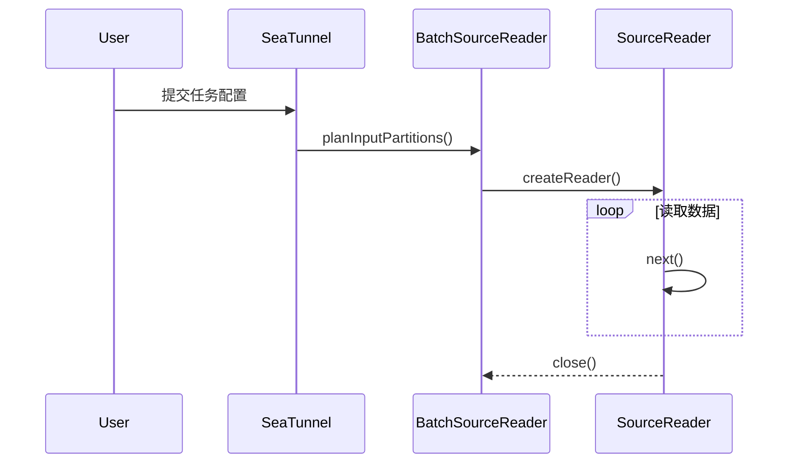
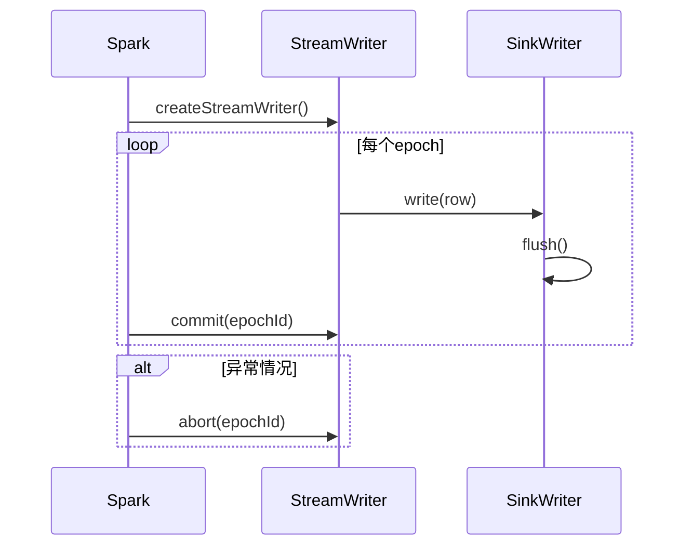

---
tags:
  - SeaTunnel
layout: post
title: SeaTunnel 中的 Spark 概述
categories:
  - SeaTunnel
  - Spark
  - 数据集成
keywords: seatunnel, spark, 数据同步, 数据源, spark datasource v2, spark sink, spark streaming
mermaid: true
sequence: true
flow: false
mathjax: false
mindmap: false
mindmap2: false
---

# SeaTunnel 中的 Spark  概述

## 1. 概述

SeaTunnel Spark适配器是SeaTunnel统一数据处理平台的核心组件之一，它通过一层适配翻译机制，将SeaTunnel的统一API映射到Apache Spark执行引擎上，从而实现统一的数据源、转换、Sink的语义执行。
本文档在原有基础上对架构设计、组件细节、性能优化、容错机制、调试监控和扩展开发进行了增强说明，帮助开发者更深入理解和高效使用该适配器。

---

## 2. 架构设计

### 2.1 整体架构

SeaTunnel Spark适配器采用三层架构模型，分别为：

- **SeaTunnel API层**：负责接收用户编排的Pipeline逻辑，统一输入输出语义。

- **Translation层**：将SeaTunnel API转换为具体计算引擎（此处为Spark）可识别的构造。

- **Spark执行引擎层**：最终在Spark平台上执行转换后的逻辑，包括读写数据、调度资源等。


```
┌─────────────────────────────────────────────────────────────┐
│                    SeaTunnel API Layer                     │
├─────────────────────────────────────────────────────────────┤
│                 Translation Layer                          │
│  ┌─────────────────┐  ┌─────────────────┐  ┌─────────────┐ │
│  │   Spark 2.4     │  │   Spark 3.3     │  │   Common    │ │
│  │  Translation    │  │  Translation    │  │ Translation │ │
│  └─────────────────┘  └─────────────────┘  └─────────────┘ │
├─────────────────────────────────────────────────────────────┤
│                    Spark Engine Layer                      │
│  ┌─────────────────┐  ┌─────────────────┐  ┌─────────────┐ │
│  │   DataSourceV2  │  │   DataSinkV2    │  │   Catalyst  │ │
│  └─────────────────┘  └─────────────────┘  └─────────────┘ │
└─────────────────────────────────────────────────────────────┘
```
### 2.2 模块结构

```
seatunnel-translation-spark/
├── seatunnel-translation-spark-2.4/          # Spark 2.4适配器
│   ├── source/                               # 数据源适配
│   │   ├── reader/                          # 读取器实现
│   │   ├── partition/                       # 分区管理
│   │   └── state/                          # 状态管理
│   └── sink/                               # 数据接收器适配
│       └── writer/                         # 写入器实现
├── seatunnel-translation-spark-3.3/          # Spark 3.3适配器
└── seatunnel-translation-spark-common/       # 通用组件
    ├── execution/                          # 执行引擎
    ├── serialization/                      # 序列化组件
    └── utils/                             # 工具类
```

### 2.3 数据读取生命周期（批处理）



### 2.4 数据写入生命周期（流处理）



## 3. 核心组件

### 3.1 启动器模块 (SparkStarter)

#### 3.1.1 主要功能

- **配置解析**：支持命令行与配置文件参数解析

- **依赖收集**：自动收集作业所需插件和Jar包

- **命令构建**：根据部署模式构建 `spark-submit` 命令

- **模式支持**：支持 Client 和 Cluster 两种模式


#### 3.1.2 核心类实现

```java
public class SparkStarter implements Starter {
    protected String[] args;
    protected SparkCommandArgs commandArgs;
    protected List<Path> jars = new ArrayList<>();
    protected Map<String, String> sparkConf;

    @Override
    public List<String> buildCommands() throws IOException {
        setSparkConf();
        Common.setDeployMode(commandArgs.getDeployMode());
        this.jars.addAll(Common.getPluginsJarDependencies());
        return buildFinal();
    }
}
```

#### 3.1.3 部署模式

- **Client模式**：适合开发调试阶段，执行过程日志本地可见
- **Cluster模式**：用于生产环境，任务运行于集群Executor中，支持更高可靠性

### 3.2 数据源适配器 (SeaTunnelSourceSupport)

#### 3.2.1 生命周期与读取流程

```java
// 批处理读取器生命周期
BatchSourceReader {
    planInputPartitions() → 创建分区
    createPartitionReader() → 创建读取器
    next() → 读取数据
    close() → 释放资源
}

// 流处理读取器生命周期
MicroBatchSourceReader {
    setOffsetRange() → 设置偏移量范围
    planInputPartitions() → 创建分区
    createPartitionReader() → 创建读取器
    next() → 读取数据
    commit() → 提交偏移量
}
```

#### 3.2.2 分区策略详解

- **协调模式**：适合有状态或全局顺序依赖的数据源，如CDC、消息队列
- **并行模式**：适合可并行读取的静态数据源，如文件、数据库快照


### 3.3 数据接收器适配器 (SparkSink)

#### 3.3.1 写入器类型分析

```java
public class SparkSink<StateT, CommitInfoT, AggregatedCommitInfoT>
        implements WriteSupport, StreamWriteSupport, DataSourceV2 {

    @Override
    public Optional<DataSourceWriter> createWriter(String writeUUID, StructType schema,
                                                 SaveMode mode, DataSourceOptions options) {
        init(options);
        return Optional.of(new SparkDataSourceWriter<>(sink, catalogTables, jobId, parallelism));
    }

    @Override
    public StreamWriter createStreamWriter(String queryId, StructType schema,
                                         OutputMode mode, DataSourceOptions options) {
        init(options);
        return new SparkStreamWriter<>(sink, catalogTables, jobId, parallelism);
    }
}
```

#### 3.3.2 写入流程与生命周期

- **批处理写入器**：构建 `DataSourceWriter`，每个任务使用 `DataWriterFactory` 实例化 `DataWriter`。
- **流处理写入器**：构建 `StreamWriter`，实现 `commit(epoch)`、`abort(epoch)` 来保障Exactly-Once语义。


#### 3.3.3 状态管理与恢复能力

```java
public class SparkStreamWriter implements StreamWriter {
    @Override
    public void commit(long epochId) {
        sinkWriter.commit();
    }

    @Override
    public void abort(long epochId) {
        sinkWriter.abort();
    }
}
```

- **状态记录**：SinkWriter实现需持久化中间状态供恢复
- **恢复机制**：失败时可基于Checkpoint恢复至上次提交点

### 3.4 多表管理器 (MultiTableManager)

#### 3.4.1 多表兼容机制

`MultiTableManager` 是SeaTunnel在处理多个CatalogTable时用于动态合并Schema和序列化器映射的关键组件。

- **单表模式**：直接使用目标表的字段定义和对应转换器

- **多表模式**：通过字段合并与索引管理，实现跨表统一字段结构


```java
public class MultiTableManager implements Serializable {
    private Map<String, InternalRowConverter> rowSerializationMap;
    private boolean isMultiTable = false;

    public MultiTableManager(CatalogTable[] catalogTables) {
        if (catalogTables.length > 1) {
            isMultiTable = true;
            // 生成表名到转换器的映射
            rowSerializationMap = buildRowConverters(catalogTables);
        }
    }
}
```

#### 3.4.2 Schema合并策略

- 对字段名和字段类型进行全局去重合并

- 构建索引映射以维持原始字段位置对应关系


```java
public List<ColumnWithIndex> mergeSchema(CatalogTable[] catalogTables) {
    List<String> fieldNames = new ArrayList<>();
    List<SeaTunnelDataType<?>> fieldTypes = new ArrayList<>();
    // 避免重复字段造成索引冲突
    // 构建IndexQueue辅助管理多表索引合并
}
```

---

## 4. 性能优化

### 4.1 内存优化策略

- **使用 InternalRow**：避免反复序列化与反序列化，提升CPU效率
- **向量化处理**：推荐使用Columnar格式，提升Cache命中率
- **资源隔离**：合理设置 `spark.memory.fraction` 与 `spark.memory.storageFraction`

### 4.2 并行度优化

- **动态分区**：根据数据量自适应调整读取/写入并发度
- **负载均衡**：通过Stage调度将热点任务均匀分配到不同Executor
- **合并小文件**：Sink阶段预合并小批次，减少Shuffle压力

> 通过 `spark.sql.adaptive.enabled=true` 开启动态任务优化。

### 4.3 网络优化建议

- **启用压缩**：建议开启 `spark.io.compression.codec=snappy`
- **本地性优先**：通过广播变量和数据预分区减少网络IO
- **合并数据包**：调高 `spark.rpc.message.maxSize` 支持批量处理

---

## 5. 容错机制

### 5.1 Checkpoint机制深度解析

```hocon
env {
  spark.sql.streaming.checkpointLocation = "/tmp/seatunnel/checkpoint"
  spark.sql.streaming.checkpoint.interval = 30000
}
```

- **结构说明**：Checkpoint目录包含Source/Sink状态信息
```
checkpoint/
├── sources/         # 各分区offset
├── sinks/           # SinkWriter状态
└── offsets/         # 全局offset对照表
```

### 5.2 两阶段提交协议（2PC）

- **Prepare阶段**：SinkWriter写入预提交标识文件
- **Commit阶段**：Sink任务提交后写入正式标识并发布结果
- **Abort阶段**：异常中止任务时删除预提交数据


> 推荐Sink使用原子性写接口（如文件重命名、事务表）配合2PC保障一致性。

### 5.3 故障恢复流程

1. Driver重启时加载Checkpoint元数据
2. Source重置Offset并启动读取器
3. Sink恢复中间状态并重新执行未完成Epoch
4. 全流程保证 Exactly-Once 数据一致性

---
## 6. 监控与调试指南

### 6.1 关键指标监控

推荐结合 Spark UI、Prometheus、Grafana 等工具监控以下指标：
- **吞吐量**：records per second
- **延迟**：end-to-end latency（来源到Sink的总时延）
- **资源利用率**：CPU、内存、GC、网络IO
- **任务失败率**：failed tasks / total tasks

> 建议启用 `spark.metrics.conf` 配置文件结合JMX导出指标。

### 6.2 日志与错误排查技巧

```bash
# 查看YARN作业状态
yarn application -status <application-id>

# 导出完整日志（Driver + Executor）
yarn logs -applicationId <application-id>

# 本地调试日志路径
logs/seatunnel-spark-<jobid>.log
```
常见错误：

|类型|典型症状|建议处理方式|
|---|---|---|
|配置错误|作业初始化失败、参数空指针|检查配置文件路径及字段格式|
|资源不足|Executor失联、频繁GC|提升Executor资源配置|
|数据格式异常|Source或Transform报错|增加字段Schema校验和异常容忍|

> 使用 `spark.eventLog.enabled=true` 可将任务运行信息保存在History Server中便于重放与分析。

### 6.3 性能调优参数推荐

```hocon
env {
  # 内存调优
  spark.executor.memory = "4g"
  spark.executor.memoryOverhead = "1g"

  # 并行度调优
  spark.sql.adaptive.enabled = true
  spark.sql.shuffle.partitions = 200

  # 网络调优
  spark.network.timeout = 800s
  spark.sql.broadcastTimeout = 3600
}
```

---

## 7. 扩展开发指南

### 7.1 自定义Source开发

```java
public class CustomSource implements SeaTunnelSource<SeaTunnelRow, ?, ?> {
    @Override
    public Boundedness getBoundedness() {
        return Boundedness.BOUNDED;
    }

    @Override
    public SourceReader<SeaTunnelRow, ?> createReader(SourceReader.Context context) {
        return new CustomSourceReader();
    }
}
```

### 7.2 自定义Sink开发

```java
public class CustomSink implements SeaTunnelSink<SeaTunnelRow, ?, ?, ?> {
    @Override
    public SinkWriter<SeaTunnelRow, ?> createWriter(SinkWriter.Context context) {
        return new CustomSinkWriter();
    }
}
```

### 7.3 自定义Transform开发

```java
public class CustomTransform implements Transform {
    @Override
    public void process(SeaTunnelRow row) {
        // 自定义字段转换逻辑
    }
}
```

> 为自定义组件增加配置验证器（`PluginValidation`）和类型声明器（`PluginDescriptor`）以提升易用性与安全性。

---

## 8. Spark 版本兼容说明

SeaTunnel Spark适配器通过模块拆分与接口抽象机制，实现对多个 Spark 版本的兼容。

### 8.1 版本支持范围

|适配版本|模块路径|支持功能|
|---|---|---|
|Spark 2.4|`seatunnel-translation-spark-2.4/`|批处理、DataSourceV2 接口、部分流处理|
|Spark 3.3|`seatunnel-translation-spark-3.3/`|批处理、流处理、Structured Streaming、Adaptive Query Execution|

未来版本如 Spark 3.5 可通过新增模块适配。

### 8.2 差异点处理策略

|差异维度|Spark 2.4|Spark 3.3|SeaTunnel适配方案|
|---|---|---|---|
|`DataSourceV2` 接口|初始版本|完善版本|使用统一抽象封装差异逻辑|
|Catalyst 优化器|无动态优化|支持 AQE|使用通用接口构造 Catalyst 规则|
|Checkpoint API|基本支持|结构增强|统一通过 Streaming Adapter 处理|

---

## 9. 总结

eaTunnel Spark适配器作为统一数据处理平台的技术核心，在架构设计、兼容性处理、性能优化及容错能力方面具备如下特点：

- **统一接口 / 屏蔽差异**：封装 Spark 版本差异，提供跨版本一致的数据源、转换、Sink定义能力。
- **版本兼容 / 可维护性强**：支持 Spark 2.4 与 3.3，具备良好的模块边界和升级路径，方便未来适配 3.5+ 等新版本。
- **高性能 / 可调优性好**：内存、并行、网络多维优化能力，支持动态分区、列式存储、压缩传输等机制。
- **高可用 / 精确一次语义**：借助 Checkpoint、状态恢复、2PC 提交协议等方式，保障作业的强一致与容错。
- **架构清晰 / 易集成扩展**：模块化组件适用于不同部署架构，便于对接不同资源平台（如 Yarn、K8s、Standalone）。
