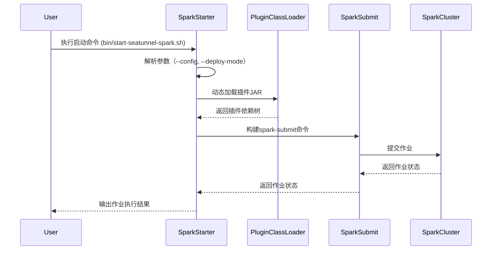

---
tags:
  - SeaTunnel
  - Spark
  - 源码解析
layout: post
title: SeaTunnel Spark 适配器源码深度解析（一）：核心架构入口
categories:
  - SeaTunnel
  - Spark
  - 数据集成
keywords: seatunnel, spark, 源码分析, 启动流程, 插件加载
mermaid: true
sequence: true
---

# SeaTunnel Spark 适配器源码深度解析（一）：核心架构入口

> 本文基于 SeaTunnel v2.3.0 源码，重点解析 `SparkStarter` 模块的设计与实现。通过本文可掌握：
>
> 1. 作业启动全流程的代码级实现
> 2. 插件动态加载的黑盒机制
> 3. 生产级调试技巧
>

## 1. 启动流程全景图



## 2. 关键代码拆解

### 2.1 参数解析核心逻辑

```java
// 源码位置：seatunnel-engine/spark/src/main/java/org/apache/seatunnel/spark/SparkCommandArgs.java
public class SparkCommandArgs {
    @Parameter(names = "--config", description = "Config file path", required = true)
    private String configPath; // 使用JCommander进行参数绑定
    
    @Parameter(names = "--deploy-mode", converter = DeployModeConverter.class)
    private DeployMode deployMode = DeployMode.CLIENT;
    
    @Parameter(names = "--master", description = "Spark master URL")
    private String master;
    
    @Parameter(names = "--queue", description = "YARN queue name")
    private String queue;
    
    // 生产环境必填参数校验
    public void validateClusterMode() {
        if (deployMode == DeployMode.CLUSTER && (master == null || queue == null)) {
            throw new IllegalArgumentException("YARN master and queue must be specified in cluster mode");
        }
    }
}
```

**设计亮点**：

- 采用「约定优于配置」原则，CLIENT模式仅需`--config`参数

- 通过枚举类强制约束部署模式，避免字符串参数错误


### 2.2 插件加载机制

```java
// 源码位置：seatunnel-core/plugin-discovery/src/main/java/org/apache/seatunnel/plugin/PluginDiscovery.java
public static List<Path> findPluginJars(Config config) {
    // 1. 从META-INF/seatunnel/plugins.index读取插件声明
    Enumeration<URL> indexes = ClassLoader.getSystemResources("META-INF/seatunnel/plugins.index");
    
    // 2. 递归解析传递依赖（通过pom.xml的<dependencies>）
    return resolveDependencies(indexes)
        .stream()
        .filter(jar -> !jar.contains("org.apache.seatunnel:seatunnel-core")) // 过滤核心包
        .collect(Collectors.toList());
}

// 插件加载隔离机制
public class PluginClassLoader extends URLClassLoader {
    private final String pluginName;
    
    public PluginClassLoader(String pluginName, URL[] urls, ClassLoader parent) {
        super(urls, parent);
        this.pluginName = pluginName;
    }
    
    @Override
    protected Class<?> loadClass(String name, boolean resolve) throws ClassNotFoundException {
        synchronized (getClassLoadingLock(name)) {
            // 优先从当前插件JAR加载类
            Class<?> c = findLoadedClass(name);
            if (c == null) {
                try {
                    c = findClass(name);
                } catch (ClassNotFoundException e) {
                    // 回退到父类加载器
                    c = super.loadClass(name, resolve);
                }
            }
            if (resolve) {
                resolveClass(c);
            }
            return c;
        }
    }
}
```

**避坑指南**：

1. 依赖冲突时采用`URLClassLoader`隔离加载，每个插件使用独立ClassLoader

2. 通过`ServiceLoader.load(SeaTunnelSource.class)`发现插件主类

3. 插件索引文件需遵循格式：`插件名:主类全限定名`


## 3. 生产级调试技巧

### 3.1 远程调试Spark作业

```bash
# 在spark-submit命令中添加JVM参数：
--conf "spark.driver.extraJavaOptions=-agentlib:jdwp=transport=dt_socket,server=y,suspend=y,address=5005"
--conf "spark.executor.extraJavaOptions=-agentlib:jdwp=transport=dt_socket,server=y,suspend=n,address=5006"
```

**IDEA配置步骤**：

1. 创建两个Remote JVM Debug配置，分别连接Driver/Executor节点

2. 关键断点位置：

   - `SparkStarter.buildCommands()`：查看最终生成的spark-submit命令

   - `PluginClassLoader.loadClass()`：观察插件类加载过程


### 3.2 依赖树分析

```bash
# 查看完整的插件依赖树
./bin/start-seatunnel-spark.sh --config your_config.conf --show-deps
```

输出示例：

```
seatunnel-connector-jdbc-2.3.0.jar
├── mysql-connector-java-8.0.28.jar
└── HikariCP-4.0.3.jar
```

## 4. 核心设计思想总结

1. **模块化设计**：

   - 启动器与核心引擎解耦，通过SPI机制扩展

   - 插件体系支持热插拔

2. **生产就绪性**：

   - 完善的参数校验和错误提示

   - 资源隔离机制避免依赖冲突

3. **插件热插拔实现原理**：

   - **插件发现机制**：
     - 通过`META-INF/seatunnel/plugins.index`文件声明插件入口类
     - 文件格式：`插件名:主类全限定名`（如`jdbc:org.apache.seatunnel.connectors.jdbc.JdbcSource`）
     - 运行时扫描所有JAR包的该文件，建立插件注册表

   - **动态加载流程**：
     1. 根据用户配置的插件名，从注册表定位插件JAR路径
     2. 创建独立的`PluginClassLoader`实例加载该JAR
     3. 通过`ServiceLoader.load(pluginClass)`实例化插件主类
     4. 插件卸载时直接丢弃对应的ClassLoader实例

   - **依赖隔离设计**：
     - 每个插件使用独立的ClassLoader，避免依赖冲突
     - 父级ClassLoader仅加载核心模块（如`seatunnel-core`）
     - 插件间禁止直接类引用，必须通过SPI接口交互

4. **调试友好性**：

   - 提供`--show-deps`等诊断参数

   - 日志明确标注各阶段耗时


> 下一篇预告：《SeaTunnel Spark 适配器源码深度解析（二）：数据源适配层》将剖析：
>
> - 从SeaTunnel Source到Spark DataSource的转换逻辑
> - 批流统一的分区策略实现
> - 状态管理机制的底层原理