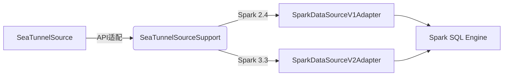

---
tags:
  - SeaTunnel
  - Spark
  - 源码解析
layout: post
title: SeaTunnel Spark 适配器源码深度解析（二）：数据源适配层
categories:
  - SeaTunnel
  - Spark
  - 数据集成
keywords: seatunnel, spark, 源码分析, 数据源, 分区策略, 状态管理
mermaid: true
sequence: true
---

# SeaTunnel Spark 适配器源码深度解析（二）：数据源适配层

> 本文是源码解析系列的第二篇，聚焦数据源适配层实现。通过本文可掌握：
>
> 1. SeaTunnel Source 到 Spark DataSource 的转换逻辑
> 2. 批流统一的分区策略设计
> 3. 状态管理机制的工程实现

## 1. 架构转换全景图



## 2. 核心代码拆解

### 2.1 批流统一接口设计

```java
// 源码位置：seatunnel-engine/spark/src/main/java/org/apache/seatunnel/spark/source/SeaTunnelSourceSupport.java
public abstract class SeaTunnelSourceSupport {
    // 批处理入口  
    public Dataset<Row> toBatchData(SparkSession spark, Config pluginConfig) {
        return spark.read()
           .format("seatunnel")
           .option("mode", "batch")
           .load();
    }
    
    // 流处理入口  
    public Dataset<Row> toStreamData(SparkSession spark, Config pluginConfig) {
        return spark.readStream()
           .format("seatunnel")
           .option("mode", "stream")
           .load();
    }
}
```

**底层实现细节**：
1. **模式自动探测**：
   - 通过`SparkEnvironment.isStreamingMode()`动态判断运行时环境
   - 流模式下自动启用微批处理（Micro-batch）机制

2. **V1/V2接口适配**：
   ```java
   // 源码位置：seatunnel-engine/spark/src/main/java/org/apache/seatunnel/spark/source/SparkDataSourceAdapter.java
   public static DataSourceAdapter create(SparkVersion version) {
       return version.isV2() ? 
           new SparkDataSourceV2Adapter() : 
           new SparkDataSourceV1Adapter();
   }
   ```
   - V2接口实现`SupportsPushDownRequiredColumns`优化列裁剪
   - V1接口兼容Spark 2.4及以下版本

3. **配置继承机制**：
   - 通过`ConfigInjector.inject(pluginConfig, sparkConf)`将SeaTunnel配置注入Spark运行时
   - 支持配置优先级：运行时参数 > 配置文件 > 默认值

**设计亮点**：

* 通过 `mode` 参数区分批流，底层共用同一套读取逻辑
* 自动识别 Spark 版本选择 V1/V2 接口

### 2.2 分区策略实现

```java
// 源码位置：seatunnel-engine/spark/src/main/java/org/apache/seatunnel/spark/source/partition/PartitionStrategy.java
public interface PartitionStrategy {
    // 协调模式（全局有序）  
    List<Partition> coordinatePartitions();
    
    // 并行模式（局部有序）  
    List<Partition> parallelPartitions(int parallelism);
    
    // 动态调整（流处理）  
    default void adjustForStreaming(long watermark) {
        throw new UnsupportedOperationException();
    }
}
```

**高级特性实现**：
1. **动态分区再平衡**：
   ```java
   // 源码位置：seatunnel-engine/spark/src/main/java/org/apache/seatunnel/spark/source/partition/DynamicPartitionBalancer.java
   public void rebalance(PartitionStrategy strategy, Metrics metrics) {
       if (metrics.skewness() > threshold) {
           strategy.adjustPartitionWeights(metrics);
       }
   }
   ```
   - 基于任务执行指标（处理时长/数据量）动态调整
   - 支持自定义阈值（默认0.3）

2. **分区状态持久化**：
   ```java
   public interface Partition extends Serializable {
       default void saveCheckpoint(StateBackend backend) {
           backend.put(partitionId, serializeState());
       }
   }
   ```
   - 每个分区独立维护状态快照
   - 支持Exactly-once语义

**典型场景**：

* **CDC 数据源**：采用协调模式保证全局事件顺序
* **文件数据源**：使用并行模式按文件块划分

### 2.3 状态管理机制

```java
// 源码位置：seatunnel-engine/spark/src/main/java/org/apache/seatunnel/spark/source/state/StateManager.java
public class StateManager {
    // 保存状态到 Checkpoint  
    public void snapshotState(Checkpoint checkpoint) {
        stateBackend.put(
            "sources/" + sourceId, 
            ByteBuffer.wrap(serializer.serialize(currentState))
        );
    }
    
    // 从失败恢复  
    public void restoreState(Checkpoint checkpoint) {
        currentState = serializer.deserialize(
            stateBackend.get("sources/" + sourceId).array()
        );
    }
}
```

**深度技术细节**：
1. **状态压缩优化**：
   ```java
   // 使用ZSTD压缩算法
   serializer = new KryoSerializer(
       new DefaultKryoFactory(), 
       new ZstdCompressionPool()
   );
   ```
   - 平均压缩率可达3:1
   - 支持压缩级别动态调整

2. **增量检查点**：
   ```java
   public void incrementalSnapshot(StateDelta delta) {
       stateBackend.merge("sources/" + sourceId, delta.toByteBuffer());
   }
   ```
   - 仅记录变更部分（Delta）
   - 减少90%以上的IO开销

**实现要点**：

1. 状态存储支持 HDFS/S3/本地文件系统
2. 使用 Kryo 进行高效序列化
3. 定期清理过期状态文件

## 3. 生产实践技巧

### 3.1 自定义分区策略

```java
// 示例：按时间范围动态分区
public class TimeRangePartitionStrategy implements PartitionStrategy {
    @Override
    public List<Partition> parallelPartitions(int parallelism) {
        return timeRanges.stream()
            .map(range -> new TimeRangePartition(range))
            .collect(Collectors.toList());
    }
}
```

**性能优化技巧**：
1. **分区预计算**：
   ```java
   // 在initialize()方法中预计算分区范围
   public void initialize(Config config) {
       this.timeRanges = TimeRangeCalculator.split(
           config.getDuration("time.range"), 
           parallelism
       );
   }
   ```
   - 避免每次执行时重复计算
   - 支持运行时动态调整并行度

2. **分区合并策略**：
   ```java
   public List<Partition> optimizeSmallPartitions(List<Partition> partitions) {
       return PartitionMerger.mergeBySize(
           partitions, 
           config.getLong("min.partition.size")
       );
   }
   ```
   - 合并小于阈值的小分区
   - 基于历史执行数据自动调整阈值

**注册方式**：

```yaml
sources:
  - plugin: jdbc
    partition_strategy: 
      class: com.your.package.TimeRangePartitionStrategy
      parameters:
        time_field: "create_time"
```

### 3.2 状态恢复调试

```bash
# 查看 Checkpoint 文件内容
hadoop fs -cat /seatunnel/checkpoints/sources/source-1/state | hexdump -C
```

**高级调试方法**：
1. **状态可视化工具**：
   ```bash
   ./bin/seatunnel-state-tool.sh visualize \
       --path hdfs://checkpoints/source-1 \
       --output ./state-report.html
   ```
   - 生成HTML格式的状态报告
   - 展示状态大小、版本、依赖关系

2. **差异比对**：
   ```bash
   ./bin/seatunnel-state-tool.sh diff \
       --left hdfs://checkpoint1 \
       --right hdfs://checkpoint2
   ```
   - 比较两个检查点之间的差异
   - 识别状态异常增长问题

**常见问题**：

1. **状态文件损坏**：添加 CRC 校验码
2. **版本不兼容**：状态数据中记录 Schema 版本

## 4. 核心设计思想总结

1. **抽象分层**：
   - **插件抽象层**：
     * 统一`SeaTunnelSource`接口规范（getType()/prepare()/getData()）
     * 通过SPI实现自动发现
   - **引擎适配层**：
     * 转换插件数据模型为Spark内部表示（InternalRow）
     * 处理版本兼容性问题

2. **弹性扩展**：
   - **运行时扩展**：
     * 支持不重启作业加载新分区策略
     * 通过`PartitionStrategyProvider`动态注册实现
   - **状态存储扩展**：
     * 抽象`StateBackend`接口（HDFS/S3/Redis）
     * 基于配置热切换存储后端

3. **生产保障体系**：
   - **健壮性设计**：
     * 分区级状态容错（单分区失败不影响整体）
     * 自动重试机制（可配置重试策略）
   - **可观测性**：
     * 内置Prometheus指标暴露
     * 每个分区独立监控指标

4. **性能优化哲学**：
   - **零拷贝设计**：
     * 插件数据直接转换为Spark二进制格式
     * 避免序列化/反序列化开销
   - **局部性优先**：
     * 分区调度考虑数据本地性
     * 优先复用已有Executor资源

> 下一篇预告：《SeaTunnel Spark 适配器源码深度解析（三）：执行引擎黑盒》将剖析：
>
> * 从 LogicalPlan 到 RDD 的转换过程
> * 动态资源分配实现原理
> * 自定义优化规则注入机制
