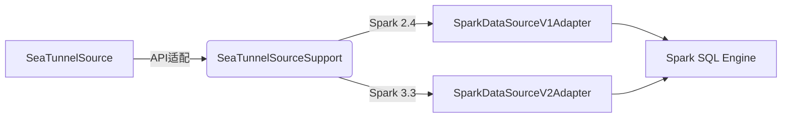

---
tags:
  - SeaTunnel
  - Spark
  - 源码解析
layout: post
title: SeaTunnel Spark 适配器源码深度解析（二）：数据源适配层
categories:
  - SeaTunnel
  - Spark
  - 数据集成
keywords: seatunnel, spark, 源码分析, 数据源, 分区策略, 状态管理
mermaid: true
sequence: true
---

# SeaTunnel Spark 适配器源码深度解析（二）：数据源适配层

> 本文是源码解析系列的第二篇，聚焦数据源适配层实现。通过本文可掌握：
>
> 1. SeaTunnel Source 到 Spark DataSource 的转换逻辑
> 2. 批流统一的分区策略设计
> 3. 状态管理机制的工程实现

## 1. 架构转换全景图



## 2. 核心代码拆解

### 2.1 批流统一接口设计

```java
// 源码位置：seatunnel-engine/spark/src/main/java/org/apache/seatunnel/spark/source/SeaTunnelSourceSupport.java
public abstract class SeaTunnelSourceSupport {
    // 批处理入口  
    public Dataset<Row> toBatchData(SparkSession spark, Config pluginConfig) {
        return spark.read()
           .format("seatunnel")
           .option("mode", "batch")
           .load();
    }
    
    // 流处理入口  
    public Dataset<Row> toStreamData(SparkSession spark, Config pluginConfig) {
        return spark.readStream()
           .format("seatunnel")
           .option("mode", "stream")
           .load();
    }
}
```

**设计亮点**：

* 通过 `mode` 参数区分批流，底层共用同一套读取逻辑
* 自动识别 Spark 版本选择 V1/V2 接口

### 2.2 分区策略实现

```java
// 源码位置：seatunnel-engine/spark/src/main/java/org/apache/seatunnel/spark/source/partition/PartitionStrategy.java
public interface PartitionStrategy {
    // 协调模式（全局有序）  
    List<Partition> coordinatePartitions();
    
    // 并行模式（局部有序）  
    List<Partition> parallelPartitions(int parallelism);
    
    // 动态调整（流处理）  
    default void adjustForStreaming(long watermark) {
        throw new UnsupportedOperationException();
    }
}
```

**典型场景**：

* **CDC 数据源**：采用协调模式保证全局事件顺序
* **文件数据源**：使用并行模式按文件块划分

### 2.3 状态管理机制

```java
// 源码位置：seatunnel-engine/spark/src/main/java/org/apache/seatunnel/spark/source/state/StateManager.java
public class StateManager {
    // 保存状态到 Checkpoint  
    public void snapshotState(Checkpoint checkpoint) {
        stateBackend.put(
            "sources/" + sourceId, 
            ByteBuffer.wrap(serializer.serialize(currentState))
        );
    }
    
    // 从失败恢复  
    public void restoreState(Checkpoint checkpoint) {
        currentState = serializer.deserialize(
            stateBackend.get("sources/" + sourceId).array()
        );
    }
}
```

**实现要点**：

1. 状态存储支持 HDFS/S3/本地文件系统
2. 使用 Kryo 进行高效序列化
3. 定期清理过期状态文件

## 3. 生产实践技巧

### 3.1 自定义分区策略

```java
// 示例：按时间范围动态分区
public class TimeRangePartitionStrategy implements PartitionStrategy {
    @Override
    public List<Partition> parallelPartitions(int parallelism) {
        return timeRanges.stream()
            .map(range -> new TimeRangePartition(range))
            .collect(Collectors.toList());
    }
}
```

**注册方式**：

```yaml
sources:
  - plugin: jdbc
    partition_strategy: 
      class: com.your.package.TimeRangePartitionStrategy
      parameters:
        time_field: "create_time"
```

### 3.2 状态恢复调试

```bash
# 查看 Checkpoint 文件内容
hadoop fs -cat /seatunnel/checkpoints/sources/source-1/state | hexdump -C
```

**常见问题**：

1. **状态文件损坏**：添加 CRC 校验码
2. **版本不兼容**：状态数据中记录 Schema 版本

## 4. 核心设计思想总结

1. **抽象分层**：

   * 将数据源差异封装在 SeaTunnel 插件层
   * Spark 层只处理通用数据模型

2. **弹性扩展**：

   * 分区策略支持动态加载
   * 状态存储可插拔替换

3. **生产保障**：

   * 完善的状态恢复测试套件
   * 内置分区负载均衡算法

> 下一篇预告：《SeaTunnel Spark 适配器源码深度解析（三）：执行引擎黑盒》将剖析：
>
> * 从 LogicalPlan 到 RDD 的转换过程
> * 动态资源分配实现原理
> * 自定义优化规则注入机制
