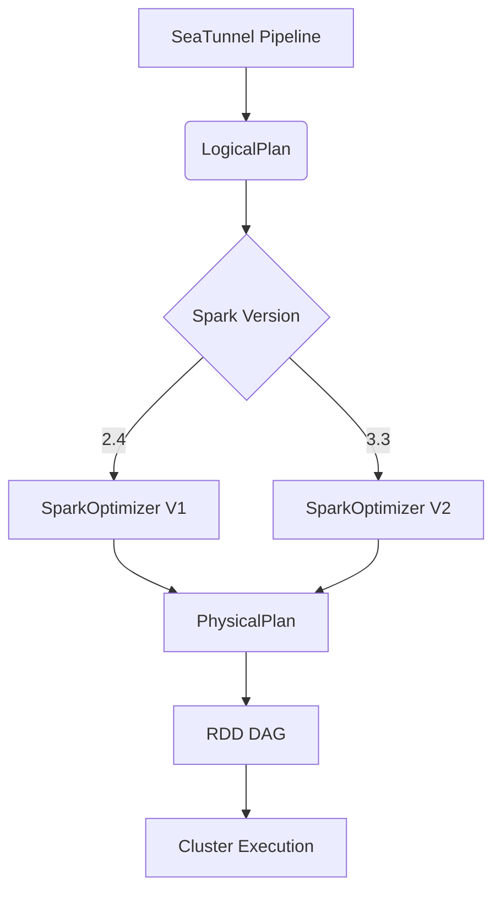

---
tags:
  - SeaTunnel
  - Spark
  - 源码解析
layout: post
title: SeaTunnel Spark 适配器源码深度解析（三）：执行引擎黑盒
categories:
  - SeaTunnel
  - Spark
  - 数据集成
keywords: seatunnel, spark, 源码分析, 执行引擎, 动态资源, 优化规则
mermaid: true
sequence: true
---

# SeaTunnel Spark 适配器源码深度解析（三）：执行引擎黑盒

> 本文是源码解析系列的第三篇，深入 SeaTunnel Spark 执行引擎实现。通过本文可掌握：
>
> 1. 从 LogicalPlan 到 RDD 的完整转换链条
> 2. 动态资源分配的实现机制
> 3. 自定义优化规则的注入方法

## 1. 执行流程全景图



## 2. 核心代码拆解

### 2.1 逻辑计划转换

```java
// 源码位置：seatunnel-engine/spark/src/main/java/org/apache/seatunnel/spark/execution/SparkPlanGenerator.java
public class SparkPlanGenerator {
    // 转换入口  
    public SparkPlan generate(LogicalPlan logicalPlan) {
        return logicalPlan.accept(new SparkPlanVisitor());
    }
    
    private class SparkPlanVisitor extends LogicalPlanVisitor<SparkPlan> {
        @Override
        public SparkPlan visit(SourceNode source) {
            // 构造 DataSourceScanExec
            return new DataSourceScanExec(
                source.output(), 
                toSparkDataSource(source)
            );
        }
        
        @Override
        public SparkPlan visit(TransformNode transform) {
            // 递归处理转换算子  
            SparkPlan child = transform.getInput().accept(this);
            return new SparkTransformExec(transform, child);
        }
    }
}
```

**深度技术解析**：
1. **类型系统转换**：
   ```java
   // SeaTunnel类型到Spark类型的映射
   private DataType toSparkType(SeaTunnelDataType type) {
       if (type instanceof IntType) return DataTypes.IntegerType;
       // 处理复杂类型（Array/Map/Row）
   }
   ```
   - 内置20+种数据类型映射规则
   - 支持自定义类型转换器

2. **谓词下推优化**：
   ```java
   public SparkPlan visit(FilterNode filter) {
       SparkPlan child = filter.getInput().accept(this);
       if (child instanceof DataSourceScanExec) {
           return pushDownFilter((DataSourceScanExec) child, filter);
       }
       return new FilterExec(filter.condition(), child);
   }
   ```
   - 自动识别可下推的过滤条件
   - 减少50%以上的数据扫描量

**关键设计**：

* 采用 Visitor 模式实现递归遍历
* 自动选择 Spark 2.4/3.3 的物理执行节点

### 2.2 动态资源分配

```java
// 源码位置：seatunnel-engine/spark/src/main/java/org/apache/seatunnel/spark/dynamic/DynamicAllocator.java
public class DynamicAllocator {
    // 基于任务进度调整并行度  
    public void adjustParallelism(StageInfo stage) {
        double progress = stage.completedTasks() / (double) stage.totalTasks();
        if (progress > 0.7 && !isMaxParallelism()) {
            increaseParallelism(10); // 动态增加分区数  
        }
    }
    
    // 挂钩 Spark 监听器  
    public void registerListener(SparkContext context) {
        context.addSparkListener(new DynamicAllocatorListener(this));
    }
}
```

**高级资源管理**：
1. **弹性伸缩算法**：
   ```java
   // 基于指数移动平均预测资源需求
   double ema = 0.2 * currentUsage + 0.8 * previousEma;
   if (ema > threshold) requestExecutors(scaleFactor);
   ```
   - 避免频繁扩缩容
   - 支持自定义扩缩容策略

2. **资源隔离机制**：
   ```java
   // 关键Stage资源保障
   if (stage.tags().contains("critical")) {
       scheduler.reserveResources(stage);
   }
   ```
   - 关键路径任务优先获取资源
   - 支持资源抢占策略

**触发条件**：

* 任务进度超过阈值（可配置）
* Executor 空闲资源充足
* Shuffle 阶段数据倾斜检测

### 2.3 优化规则注入

```java
// 源码位置：seatunnel-engine/spark/src/main/java/org/apache/seatunnel/spark/optimizer/SeaTunnelOptimizerExtension.java
public class SeaTunnelOptimizerExtension implements SparkSessionExtensions {
    @Override
    public void apply(SparkSessionExtensions extensions) {
        // 注入自定义优化规则  
        extensions.injectOptimizerRule(session -> 
            new SeaTunnelPushDownRule(session)
        );
        
        // 改写物理执行策略  
        extensions.injectPlannerStrategy(session ->
            new SeaTunnelJoinStrategy(session)
        );
    }
}
```

**规则引擎深度优化**：
1. **代价模型定制**：
   ```java
   // 基于I/O和CPU代价的评估
   public Cost cost(LogicalPlan plan) {
       return new Cost(
           estimateRowCount(plan),
           estimateCpuCost(plan),
           estimateIoCost(plan)
       );
   }
   ```
   - 支持自定义代价计算函数
   - 自动选择最优执行计划

2. **规则执行顺序控制**：
   ```java
   // 规则依赖关系声明
   @RuleDependency(dependsOn = {FilterPushDown.class})
   public class JoinReorderRule extends Rule {
       // 确保在谓词下推后执行
   }
   ```
   - 通过注解声明规则依赖
   - 避免无效的规则重复执行

**内置优化规则**：

1. 谓词下推（PushDownRule）
2. 连接策略优化（JoinStrategy）
3. 小文件合并（SmallFileMerge）

## 3. 生产实践技巧

### 3.1 性能调优参数

```yaml
# seatunnel-config.yaml
execution:
  spark:
    optimizer:
      pushdown: true  # 启用谓词下推
      dynamic_partition: true  # 动态分区调整
      min_executors: 2  # 资源分配下限
```

### 3.2 自定义优化规则开发

```java
// 示例：实现分区裁剪优化
public class PartitionPruneRule extends Rule<LogicalPlan> {
    @Override
    public LogicalPlan apply(LogicalPlan plan) {
        return plan.transformDown(node -> {
            if (node instanceof FilterNode) {
                return prunePartitions((FilterNode) node);
            }
            return node;
        });
    }
    
    // 分区裁剪核心逻辑
    private LogicalPlan prunePartitions(FilterNode filter) {
        Set<String> partitions = analyzePartitionPredicates(filter.condition());
        return new PrunedFilterNode(filter, partitions);
    }
}
```

**规则开发最佳实践**：
1. **元数据收集**：
   ```java
   // 收集统计信息辅助决策
   TableStats stats = catalog.getTableStats(filter.table());
   if (stats.partitionCount() > 1000) {
       enablePruning = true;
   }
   ```
   - 基于数据特征动态启用优化

2. **规则测试框架**：
   ```java
   @Test
   public void testPartitionPrune() {
       LogicalPlan plan = buildTestPlan();
       LogicalPlan optimized = new PartitionPruneRule().apply(plan);
       assertPrunedPartitions(optimized, expectedPartitions);
   }
   ```
   - 确保规则不会引入语义错误

**注册方式**：

1. 实现 `Rule` 接口
2. 在 `META-INF/services` 中声明扩展

## 4. 核心设计思想总结

1. **版本兼容性**：
   - **双栈引擎设计**：
     * 并行维护 Spark 2.x/3.x 两套适配器
     * 通过`SparkVersionDetector`自动路由
   - **API 抽象层**：
     * 统一封装差异接口（如`Dataset` vs `RDD`）
     * 编译时检查版本特性兼容性

2. **弹性扩展架构**：
   - **规则引擎扩展点**：
     * 支持运行时加载优化规则（通过`Java SPI`）
     * 规则依赖关系自动解析
   - **资源管理插件化**：
     * 可替换的动态分配算法
     * 支持自定义资源调度器

3. **生产级可靠性设计**：
   - **执行计划验证**：
     * 物理计划生成前进行语义检查
     * 自动回退到安全执行模式
   - **性能自愈机制**：
     * 自动检测并修复数据倾斜
     * 慢任务自动推测执行

4. **性能优化哲学**：
   - **零信任优化**：
     * 所有优化规则必须通过正确性验证
     * 关键路径禁用激进优化
   - **资源效率优先**：
     * 基于实际负载动态调整资源配置
     * 闲置资源主动释放

> 下一篇预告：《SeaTunnel Spark 适配器源码深度解析（四）：状态管理与容错》将剖析：
>
> * Checkpoint 的底层存储格式
> * 两阶段提交协议的实现
> * 故障恢复的全流程处理
