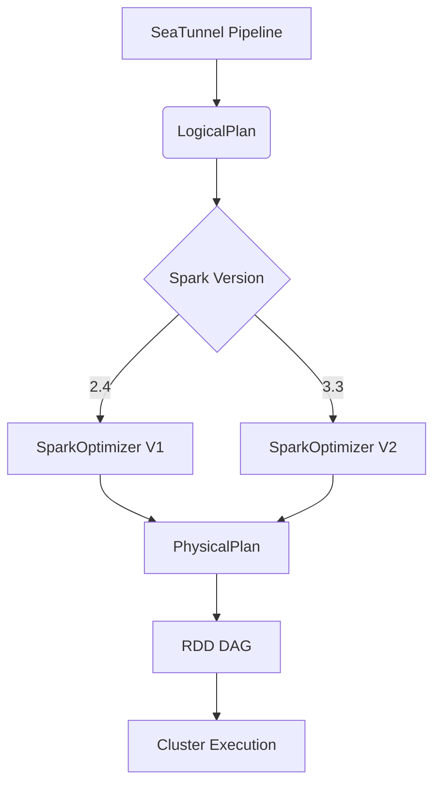

```
tags:
  - SeaTunnel
  - Spark
  - 源码解析
layout: post
title: SeaTunnel Spark 适配器源码深度解析（三）：执行引擎黑盒
categories:
  - SeaTunnel
  - Spark
  - 数据集成
keywords: seatunnel, spark, 源码分析, 执行引擎, 动态资源, 优化规则
mermaid: true
sequence: true
```

# SeaTunnel Spark 适配器源码深度解析（三）：执行引擎黑盒

> 本文是源码解析系列的第三篇，深入 SeaTunnel Spark 执行引擎实现。通过本文可掌握：
>
> 1. 从 LogicalPlan 到 RDD 的完整转换链条
> 2. 动态资源分配的实现机制
> 3. 自定义优化规则的注入方法

## 1. 执行流程全景图



## 2. 核心代码拆解

### 2.1 逻辑计划转换

```java
// 源码位置：seatunnel-engine/spark/src/main/java/org/apache/seatunnel/spark/execution/SparkPlanGenerator.java
public class SparkPlanGenerator {
    // 转换入口  
    public SparkPlan generate(LogicalPlan logicalPlan) {
        return logicalPlan.accept(new SparkPlanVisitor());
    }
    
    private class SparkPlanVisitor extends LogicalPlanVisitor<SparkPlan> {
        @Override
        public SparkPlan visit(SourceNode source) {
            // 构造 DataSourceScanExec
            return new DataSourceScanExec(
                source.output(), 
                toSparkDataSource(source)
            );
        }
        
        @Override
        public SparkPlan visit(TransformNode transform) {
            // 递归处理转换算子  
            SparkPlan child = transform.getInput().accept(this);
            return new SparkTransformExec(transform, child);
        }
    }
}
```

**关键设计**：

* 采用 Visitor 模式实现递归遍历
* 自动选择 Spark 2.4/3.3 的物理执行节点

### 2.2 动态资源分配

```java
// 源码位置：seatunnel-engine/spark/src/main/java/org/apache/seatunnel/spark/dynamic/DynamicAllocator.java
public class DynamicAllocator {
    // 基于任务进度调整并行度  
    public void adjustParallelism(StageInfo stage) {
        double progress = stage.completedTasks() / (double) stage.totalTasks();
        if (progress > 0.7 && !isMaxParallelism()) {
            increaseParallelism(10); // 动态增加分区数  
        }
    }
    
    // 挂钩 Spark 监听器  
    public void registerListener(SparkContext context) {
        context.addSparkListener(new DynamicAllocatorListener(this));
    }
}
```

**触发条件**：

* 任务进度超过阈值（可配置）
* Executor 空闲资源充足
* Shuffle 阶段数据倾斜检测

### 2.3 优化规则注入

```java
// 源码位置：seatunnel-engine/spark/src/main/java/org/apache/seatunnel/spark/optimizer/SeaTunnelOptimizerExtension.java
public class SeaTunnelOptimizerExtension implements SparkSessionExtensions {
    @Override
    public void apply(SparkSessionExtensions extensions) {
        // 注入自定义优化规则  
        extensions.injectOptimizerRule(session -> 
            new SeaTunnelPushDownRule(session)
        );
        
        // 改写物理执行策略  
        extensions.injectPlannerStrategy(session ->
            new SeaTunnelJoinStrategy(session)
        );
    }
}
```

**内置优化规则**：

1. 谓词下推（PushDownRule）
2. 连接策略优化（JoinStrategy）
3. 小文件合并（SmallFileMerge）

## 3. 生产实践技巧

### 3.1 性能调优参数

```yaml
# seatunnel-config.yaml
execution:
  spark:
    optimizer:
      pushdown: true  # 启用谓词下推
      dynamic_partition: true  # 动态分区调整
      min_executors: 2  # 资源分配下限
```

### 3.2 自定义优化规则开发

```java
// 示例：实现分区裁剪优化
public class PartitionPruneRule extends Rule<LogicalPlan> {
    @Override
    public LogicalPlan apply(LogicalPlan plan) {
        return plan.transformDown(node -> {
            if (node instanceof FilterNode) {
                return prunePartitions((FilterNode) node);
            }
            return node;
        });
    }
}
```

**注册方式**：

1. 实现 `Rule` 接口
2. 在 `META-INF/services` 中声明扩展

## 4. 核心设计思想总结

1. **版本兼容性**：

   * 通过抽象层屏蔽 Spark 版本差异
   * 运行时动态选择执行策略

2. **弹性扩展**：

   * 优化规则支持热加载
   * 资源分配策略可配置化

3. **生产保障**：

   * 内置关键性能优化规则
   * 完善的动态调整监控指标

> 下一篇预告：《SeaTunnel Spark 适配器源码深度解析（四）：状态管理与容错》将剖析：
>
> * Checkpoint 的底层存储格式
> * 两阶段提交协议的实现
> * 故障恢复的全流程处理
