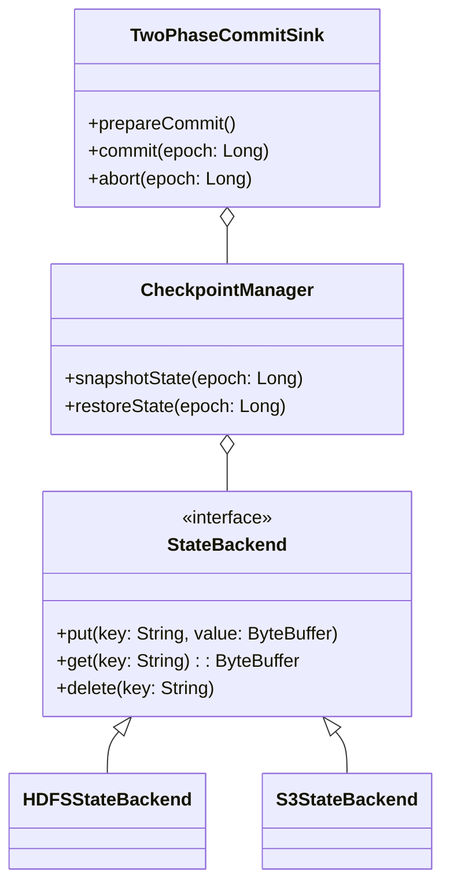

```
tags:
  - SeaTunnel
  - Spark
  - 源码解析
layout: post
title: SeaTunnel Spark 适配器源码深度解析（四）：状态管理与容错
categories:
  - SeaTunnel
  - Spark
  - 数据集成
keywords: seatunnel, spark, 源码分析, 状态管理, 容错机制, checkpoint
mermaid: true
sequence: true
```

# SeaTunnel Spark 适配器源码深度解析（四）：状态管理与容错

> 本文是源码解析系列的第四篇，深入剖析状态管理与容错机制。通过本文可掌握：
>
> 1. Checkpoint 的底层存储结构与恢复流程
>
> 2. 两阶段提交协议的具体实现
>
> 3. 故障恢复的全链路处理机制
>

## 1. 状态管理架构全景图



## 2. 核心代码拆解

### 2.1 Checkpoint 存储结构

```java
// 源码位置：seatunnel-engine/spark/src/main/java/org/apache/seatunnel/spark/state/CheckpointFormat.java
public class CheckpointFormat {
    // Checkpoint 文件目录结构  
    public static final String STRUCTURE = """
    checkpoint_${epoch}/
    ├── metadata        # 元信息（版本号/时间戳）
    ├── sources/        # 数据源状态
    │   ├── source1/    # 分区状态
    │   └── source2/
    └── sinks/         # Sink 状态
        ├── sink1/     # 预提交标识
        └── sink2/
    """;
    
    // 序列化方法  
    public byte[] serialize(State state) {
        ByteBuffer buffer = ByteBuffer.allocate(1024);
        buffer.putLong(state.version());
        buffer.put(state.bytes());
        return buffer.array();
    }
}
```

**设计要点**：

- 采用多级目录隔离不同组件状态

- 元数据与状态数据分离存储

- 支持增量 Checkpoint


### 2.2 两阶段提交实现

```java
// 源码位置：seatunnel-engine/spark/src/main/java/org/apache/seatunnel/spark/sink/TwoPhaseCommitSink.java
public class TwoPhaseCommitSink {
    // 阶段一：预提交  
    public void prepareCommit() {
        // 写入临时文件  
        tempFile = createTempFile();
        writeData(tempFile);
        
        // 记录预提交状态  
        checkpointManager.snapshotState(epoch);
    }
    
    // 阶段二：正式提交  
    public void commit(long epoch) {
        // 原子性重命名文件  
        renameFile(tempFile, finalFile);
        
        // 清理预提交状态  
        checkpointManager.cleanPrepared(epoch);
    }
}
```

**容错保障**：

1. 预提交状态持久化到可靠存储

2. 最终提交使用原子操作（如 HDFS rename）

3. 超时自动回滚机制


### 2.3 故障恢复流程

```java
// 源码位置：seatunnel-engine/spark/src/main/java/org/apache/seatunnel/spark/recovery/RecoveryManager.java
public class RecoveryManager {
    public void recover() {
        // 1. 定位最新有效 Checkpoint  
        long latestEpoch = findLatestValidCheckpoint();
        
        // 2. 恢复数据源状态  
        sourceStates = checkpointManager.restoreSources(latestEpoch);
        
        // 3. 处理未完成提交  
        handlePendingCommits(latestEpoch);
    }
    
    private void handlePendingCommits(long epoch) {
        if (checkpointManager.isPrepared(epoch)) {
            // 根据业务语义决定提交或回滚  
            if (shouldCommit(epoch)) {
                sink.commit(epoch);
            } else {
                sink.abort(epoch);
            }
        }
    }
}
```

**恢复策略**：

- 数据源：重置 offset 到 Checkpoint 记录位置

- 转换算子：重建中间状态

- Sink：重新执行未完成 epoch


## 3. 生产实践技巧

### 3.1 Checkpoint 调优参数

```yaml
execution:
  spark:
    checkpoint:
      interval: 30000     # 触发间隔(ms)
      timeout: 600000     # 超时时间(ms)
      max_retain: 10      # 保留个数
      storage: "hdfs://..." # 存储路径
```

### 3.2 自定义状态后端

```java
// 示例：实现 Redis 状态后端
public class RedisStateBackend implements StateBackend {
    @Override
    public void put(String key, ByteBuffer value) {
        redisClient.set(
            key, 
            Base64.getEncoder().encodeToString(value.array())
        );
    }
    
    @Override
    public ByteBuffer get(String key) {
        String data = redisClient.get(key);
        return ByteBuffer.wrap(Base64.getDecoder().decode(data));
    }
}
```

**注册方式**：

```properties
# META-INF/services/org.apache.seatunnel.spark.state.StateBackend
com.your.package.RedisStateBackend
```

## 4. 核心设计思想总结

1. **一致性保障**：

   - 通过两阶段提交（2PC）实现精确一次语义

   - 状态变更原子化持久化

2. **扩展性设计**：

   - 状态存储支持插件化替换

   - 恢复策略可定制

3. **生产可靠性**：

   - 完善的 Checksum 校验机制

   - 自动化脏数据清理


> 本系列完整代码解析已完结，关键要点总结：
>
> 1. **架构分层**：API适配层 → 执行引擎层 → 资源调度层
>
> 2. **核心机制**：动态分区 → 状态管理 → 优化规则
>
> 3. **生产保障**：调试工具链 → 性能指标 → 容错设计 
