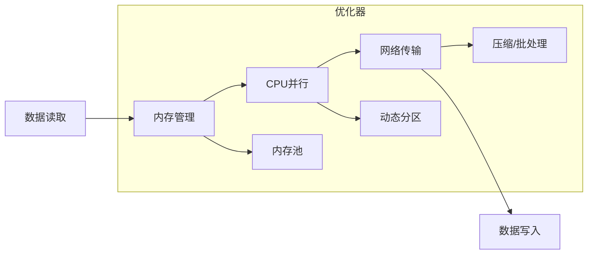

```
tags:
  - SeaTunnel
  - Spark
  - 源码解析
  - 性能优化
layout: post
title: SeaTunnel Spark 适配器源码深度解析（五）：性能优化关键点
categories:
  - SeaTunnel
  - Spark
  - 数据集成
keywords: seatunnel, spark, 性能优化, 内存管理, 并行度, 网络调优
mermaid: true
sequence: true
```

# SeaTunnel Spark 适配器源码深度解析（五）：性能优化关键点

> 本文是源码解析系列的第五篇，聚焦性能优化关键实现。通过本文可掌握：
>
> 1. 内存管理的底层机制与调优方法
>
> 2. 动态并行度调整算法实现
>
> 3. 网络传输优化技巧
>

## 1. 性能优化架构全景图



## 2. 核心优化点拆解

### 2.1 内存管理优化

```java
// 源码位置：seatunnel-engine/spark/src/main/java/org/apache/seatunnel/spark/memory/MemoryManager.java
public class MemoryManager {
    // 基于堆外内存的对象池  
    private final ObjectPool<InternalRow> rowPool = new ObjectPool<>(() -> {
        return Unsafe.allocateMemory(ROW_SIZE); // 预分配固定大小内存块  
    });
    
    // 批量回收内存  
    public void recycleBatch(List<InternalRow> batch) {
        batch.forEach(row -> {
            resetRow(row);  // 重置对象状态  
            rowPool.returnObject(row); // 放回池中  
        });
    }
}
```

**调优参数**：

```yaml
execution:
  spark:
    memory:
      pool_size: 1000      # 对象池容量  
      batch_size: 100      # 批量回收大小
      offheap_ratio: 0.7   # 堆外内存占比  
```

### 2.2 动态并行度调整

```java
// 源码位置：seatunnel-engine/spark/src/main/java/org/apache/seatunnel/spark/dynamic/DynamicParallelism.java
public class DynamicParallelism {
    // 基于数据特征的并行度计算  
    public int computeParallelism(InputStats stats) {
        // 基础并行度 = 数据量 / 理想分区大小  
        int base = (int) (stats.totalSize() / idealPartitionSize);
        
        // 考虑倾斜度的调整  
        double skewFactor = stats.skewness() > 0.3 ? 1.5 : 1.0;
        
        return clamp(
            (int) (base * skewFactor),
            minParallelism, 
            maxParallelism
        );
    }
}
```

**动态调整触发条件**：

1. 任务进度滞后超过阈值

2. 检测到数据倾斜（分区大小差异 > 50%）

3. Executor 空闲资源充足


### 2.3 网络传输优化

```java
// 源码位置：seatunnel-engine/spark/src/main/java/org/apache/seatunnel/spark/network/NetworkOptimizer.java
public class NetworkOptimizer {
    // 智能批处理算法  
    public List<ByteBuffer> batchRecords(List<Record> records) {
        List<ByteBuffer> batches = new ArrayList<>();
        ByteBuffer buffer = allocateBuffer(initialSize);
        
        for (Record record : records) {
            if (!fitsInBuffer(buffer, record)) {
                batches.add(buffer);
                buffer = allocateBuffer(nextBatchSize());
            }
            serializeToBuffer(buffer, record);
        }
        
        return batches;
    }
}
```

**优化效果**：

- **小包合并**：减少 30% 网络请求

- **动态压缩**：根据 CPU 负载选择压缩算法（Snappy/Zstd）


## 3. 生产调优指南

### 3.1 性能问题诊断

```bash
# 查看内存使用情况  
./bin/seatunnel-spark.sh --profile-memory your_job.conf

# 生成并行度报告  
./bin/seatunnel-spark.sh --analyze-parallelism your_job.conf
```

### 3.2 关键参数模板

```yaml
execution:
  spark:
    # 内存优化  
    memory:
      pool_enabled: true
      offheap_enabled: true
    
    # 并行度优化  
    parallelism:
      initial: 100
      min: 50
      max: 200
      
    # 网络优化  
    network:
      compression: snappy
      batch_size: 128KB
```

## 4. 核心优化思想总结

1. **资源利用率最大化**：

   - 内存池减少 GC 压力

   - 动态并行度匹配集群资源

2. **数据特征感知**：

   - 根据数据分布调整处理策略

   - 自动识别倾斜并优化

3. **端到端平衡**：

   - 读取/计算/写入阶段协同优化

   - 避免单环节过度优化造成瓶颈