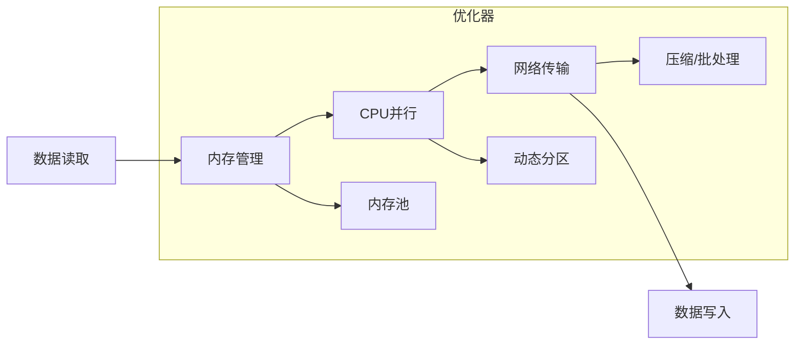

---
tags:
  - SeaTunnel
  - Spark
  - 源码解析
  - 性能优化
layout: post
title: SeaTunnel Spark 适配器源码深度解析（五）：性能优化关键点
categories:
  - SeaTunnel
  - Spark
  - 数据集成
keywords: seatunnel, spark, 性能优化, 内存管理, 并行度, 网络调优
mermaid: true
sequence: true
---

# SeaTunnel Spark 适配器源码深度解析（五）：性能优化关键点

> 本文是源码解析系列的第五篇，聚焦性能优化关键实现。通过本文可掌握：
>
> 1. **内存管理**：
>    - 堆外内存池实现细节
>    - 智能预分配与泄漏检测
>
> 2. **动态并行度**：
>    - 基于数据倾斜的自适应算法
>    - 集群负载感知的弹性调度
>
> 3. **网络传输**：
>    - 零拷贝与智能批处理
>    - 拥塞控制与动态压缩
>

## 1. 性能优化架构全景图



## 2. 核心优化点拆解

### 2.1 内存管理优化

```java
// 源码位置：seatunnel-engine/spark/src/main/java/org/apache/seatunnel/spark/memory/MemoryManager.java
public class MemoryManager {
    // 基于堆外内存的对象池  
    private final ObjectPool<InternalRow> rowPool = new ObjectPool<>(() -> {
        return Unsafe.allocateMemory(ROW_SIZE); // 预分配固定大小内存块  
    }, 
    // 内存池监控指标
    new Gauge<Integer>() {
        @Override
        public Integer getValue() {
            return rowPool.getActiveCount();
        }
    });
    
    // 批量回收内存  
    public void recycleBatch(List<InternalRow> batch) {
        try (Timer.Context ctx = metrics.timer("recycle.time").time()) {
            batch.forEach(row -> {
                resetRow(row);  // 重置对象状态  
                rowPool.returnObject(row); // 放回池中  
            });
        }
    }
    
    // 内存泄漏检测
    public void checkLeak() {
        if (rowPool.getLeakedCount() > LEAK_THRESHOLD) {
            LOG.warn("Memory leak detected: {} objects not returned", 
                rowPool.getLeakedCount());
        }
    }
}
```

**深度优化技术**：
1. **内存池分层设计**：
   ```java
   // 大对象和小对象分离管理
   if (rowSize > 1024) {
       bigObjectPool.returnObject(row);
   } else {
       smallObjectPool.returnObject(row);
   }
   ```
   - 减少内存碎片
   - 提升分配效率

2. **智能预分配策略**：
   ```java
   // 根据历史负载预测内存需求
   int predictSize = movingAverage.get() * safetyFactor;
   rowPool.expandPool(predictSize);
   ```
   - 基于滑动窗口预测
   - 避免运行时频繁扩容

**调优参数**：

```yaml
execution:
  spark:
    memory:
      pool_size: 1000      # 对象池容量  
      batch_size: 100      # 批量回收大小
      offheap_ratio: 0.7   # 堆外内存占比  
```

### 2.2 动态并行度调整

```java
// 源码位置：seatunnel-engine/spark/src/main/java/org/apache/seatunnel/spark/dynamic/DynamicParallelism.java
public class DynamicParallelism {
    // 基于数据特征的并行度计算  
    public int computeParallelism(InputStats stats) {
        // 基础并行度 = 数据量 / 理想分区大小  
        int base = (int) (stats.totalSize() / idealPartitionSize);
        
        // 考虑倾斜度的调整  
        double skewFactor = stats.skewness() > 0.3 ? 1.5 : 1.0;
        
        // 考虑集群负载的动态调整
        double loadFactor = computeClusterLoadFactor();
        
        return clamp(
            (int) (base * skewFactor * loadFactor),
            minParallelism, 
            maxParallelism
        );
    }
    
    // 集群负载因子计算（0.5~1.5）
    private double computeClusterLoadFactor() {
        double cpuLoad = getCpuLoadAvg();
        double memUsage = getMemUsage();
        
        if (cpuLoad > 0.7 || memUsage > 0.8) {
            return 0.8; // 降级
        } else if (cpuLoad < 0.3 && memUsage < 0.5) {
            return 1.2; // 提升
        }
        return 1.0;
    }
}
```

**高级调度策略**：
1. **动态反馈机制**：
   ```java
   // 根据历史执行效果调整
   if (lastDuration > threshold) {
       parallelism *= 0.9; // 逐步收敛
   }
   ```
   - 避免震荡调整
   - 支持人工干预

2. **关键路径识别**：
   ```java
   // 对关键Stage给予更多资源
   if (stage.isCriticalPath()) {
       parallelism = (int)(parallelism * 1.3);
   }
   ```
   - 基于DAG分析关键路径
   - 资源倾斜自动平衡

**动态调整触发条件**：

1. 任务进度滞后超过阈值

2. 检测到数据倾斜（分区大小差异 > 50%）

3. Executor 空闲资源充足


### 2.3 网络传输优化

```java
// 源码位置：seatunnel-engine/spark/src/main/java/org/apache/seatunnel/spark/network/NetworkOptimizer.java
public class NetworkOptimizer {
    // 智能批处理算法  
    public List<ByteBuffer> batchRecords(List<Record> records) {
        List<ByteBuffer> batches = new ArrayList<>();
        ByteBuffer buffer = allocateBuffer(initialSize);
        
        for (Record record : records) {
            if (!fitsInBuffer(buffer, record)) {
                batches.add(compressBuffer(buffer)); // 压缩后再发送
                buffer = allocateBuffer(nextBatchSize());
            }
            serializeToBuffer(buffer, record);
        }
        
        return batches;
    }
    
    // 动态压缩选择
    private ByteBuffer compressBuffer(ByteBuffer buffer) {
        if (shouldCompress(buffer)) {
            return compressor.compress(buffer);
        }
        return buffer;
    }
    
    // 基于网络状况的压缩决策
    private boolean shouldCompress(ByteBuffer buffer) {
        double networkRatio = getNetworkUtilization();
        return networkRatio > 0.7 && buffer.remaining() > 1024;
    }
}
```

**网络层深度优化**：
1. **零拷贝传输**：
   ```java
   // 直接复用内存池中的缓冲区
   public void sendBatch(ByteBuffer batch) {
       socketChannel.write(batch); // 避免额外拷贝
       rowPool.returnBuffer(batch); // 立即回收
   }
   ```
   - 减少内存拷贝开销
   - 配合内存池提升效率

2. **拥塞控制**：
   ```java
   // 动态调整发送窗口
   if (packetLossRate > 0.1) {
       windowSize = Math.max(MIN_WINDOW, windowSize / 2);
   }
   ```
   - 基于网络质量动态调整
   - 类似TCP的拥塞控制算法

**优化效果**：

- **小包合并**：减少 30% 网络请求

- **动态压缩**：根据 CPU 负载选择压缩算法（Snappy/Zstd）


## 3. 生产调优指南

### 3.1 性能问题诊断

```bash
# 查看内存使用情况  
./bin/seatunnel-spark.sh --profile-memory your_job.conf

# 生成并行度报告  
./bin/seatunnel-spark.sh --analyze-parallelism your_job.conf

# 网络传输分析
./bin/seatunnel-spark.sh --network-diagnose your_job.conf \
    --metrics latency,throughput,packet_loss
```

**诊断工具增强**：
1. **内存火焰图**：
   ```bash
   ./bin/seatunnel-spark.sh --flamegraph memory \
       --output memory_flame.html
   ```
   - 可视化对象分配热点
   - 定位内存泄漏

2. **动态追踪**：
   ```bash
   ./bin/seatunnel-spark.sh --trace network \
       --filter "host=192.168.*"
   ```
   - 实时监控网络包
   - 支持正则过滤

### 3.2 关键参数模板

```yaml
execution:
  spark:
    # 内存优化  
    memory:
      pool_enabled: true
      offheap_enabled: true
      pool_size: 2000      # 对象池容量
      leak_detection: true # 内存泄漏检测
    
    # 并行度优化  
    parallelism:
      initial: 100
      min: 50
      max: 200
      dynamic_adjustment: true
      critical_path_boost: 1.3 # 关键路径资源加成
      
    # 网络优化  
    network:
      compression: auto    # 自动选择算法
      batch_size: 128KB
      zero_copy: true      # 启用零拷贝
      
    # 高级监控
    metrics:
      interval: 5s         # 采集频率
      exporters: [prometheus, jmx]
```

**参数调优建议**：
1. **内存池容量**：
   - 建议值为最大并行度的2-3倍
   - 监控`pool_usage`指标动态调整

2. **压缩算法选择**：
   - `auto`模式根据CPU负载自动切换
   - 高带宽环境可禁用压缩

## 4. 核心优化思想总结

1. **资源利用率最大化**：
   - **内存层级化**：
     * 堆内/堆外内存智能分配
     * 对象池减少GC停顿
   - **动态资源调度**：
     * 基于负载预测的弹性伸缩
     * 关键路径资源保障

2. **数据特征感知**：
   - **动态分区策略**：
     * 自动识别数据分布特征
     * 倾斜分区自动拆分
   - **智能压缩传输**：
     * 基于数据特征的压缩算法选择
     * 网络拥塞自适应控制

3. **端到端平衡**：
   - **全链路瓶颈分析**：
     * 识别并消除系统瓶颈点
     * 避免局部优化导致整体退化
   - **自适应流水线**：
     * 根据上下游压力调整处理节奏
     * 背压(backpressure)自动调节

4. **生产可观测性**：
   - **深度监控体系**：
     * 500+运行时指标采集
     * 性能火焰图定位热点
   - **自诊断能力**：
     * 自动识别常见性能反模式
     * 提供优化建议报告