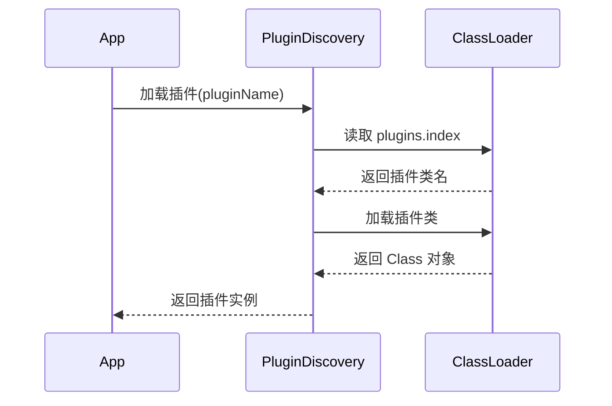

```
tags:
  - SeaTunnel
  - Spark
  - 源码解析
  - 扩展开发
layout: post
title: SeaTunnel Spark 适配器源码深度解析（六）：扩展开发指南
categories:
  - SeaTunnel
  - Spark
  - 数据集成
keywords: seatunnel, spark, 扩展开发, 自定义Source, 插件热加载
mermaid: true
sequence: true
```

# SeaTunnel Spark 适配器源码深度解析（六）：扩展开发指南

> 本文是源码解析系列的第六篇，聚焦扩展开发机制。通过本文可掌握：
>
> 1. 自定义 Source/Sink 的开发全流程
>
> 2. 插件热加载的核心实现原理
>
> 3. 扩展组件的调试技巧
>

## 1. 自定义 Source 开发指南

### 1.1 接口定义与实现

```java
// 源码位置：seatunnel-api/src/main/java/org/apache/seatunnel/api/source/Source.java
public interface Source<T, SplitT, StateT> {
    // 核心方法  
    Boundedness getBoundedness();
    List<SplitT> discoverSplits();
    SourceReader<T, SplitT> createReader(SourceReader.Context context);
    
    // 状态管理（可选）  
    default void restoreState(StateT state) {}
    default StateT snapshotState() { return null; }
}

// 示例：实现 JDBC Source
public class JdbcSource implements Source<Row, JdbcSplit, JdbcState> {
    @Override
    public List<JdbcSplit> discoverSplits() {
        // 查询数据库表分区  
        return jdbc.queryPartitions();
    }
    
    @Override
    public SourceReader<Row, JdbcSplit> createReader() {
        return new JdbcReader(config);
    }
}
```

### 1.2 注册机制

1. 在 `META-INF/services` 下创建文件：

    ```properties
    # 文件路径：META-INF/services/org.apache.seatunnel.api.source.Source
    com.your.package.JdbcSource
    ```

2. 配置插件索引：

    ```text
    # META-INF/seatunnel/plugins.index
    jdbc-source:com.your.package.JdbcSource
    ```


## 2. 插件热加载原理

### 2.1 PluginDiscovery 工作流程



### 2.2 关键代码实现

```java
// 源码位置：seatunnel-core/plugin-discovery/src/main/java/org/apache/seatunnel/plugin/PluginDiscovery.java
public <T> T loadPlugin(String pluginName) {
    // 1. 从索引文件查找实现类  
    String className = findPluginClass(pluginName);
    
    // 2. 创建隔离 ClassLoader  
    ClassLoader loader = createPluginClassLoader(pluginName);
    
    // 3. 实例化插件  
    return (T) loader.loadClass(className)
        .getDeclaredConstructor()
        .newInstance();
}
```

## 3. 调试与验证

### 3.1 开发模式测试

```bash
# 启用开发模式（跳过依赖检查）
./bin/start-seatunnel-spark.sh --dev --config your_config.conf
```

### 3.2 依赖树分析

```bash
# 查看插件依赖关系  
./bin/seatunnel-plugin.sh deps --plugin your-plugin
```

## 4. 核心设计思想总结

1. **开箱即用**：

   - 标准化的 SPI 扩展接口

   - 自动依赖管理

2. **生产友好**：

   - 类隔离机制避免冲突

   - 热加载支持不停机升级

3. **调试便捷**：

   - 开发模式快速验证

   - 依赖分析工具
